# Phase 25 — Enterprise Identity & Secure Client Platform

**Status:** Complete (foundation scope, per spec §OBJECTIVE - commercial
licensing/payment/usage limitations explicitly excluded)

## Objective

Build the architecture required for secure Windows/Desktop, Android, and
future Web clients while preserving the approved Hybrid Offline/Online
model: enterprise identity (organization/branch/workspace/user/device/
installation/session), device registration, secure authentication,
offline certificates, a hybrid sync queue, a secure API client, and the
security primitives (encryption, key management, secure storage) all of
the above sit on. Foundation only - no commercial licensing, no trial
logic, no payment enforcement, no UI changes to already-completed pages.

## Architecture Summary

```mermaid
flowchart TB
    subgraph Domain["Domain (Rojan.Desktop.Domain)"]
        DI["Identity/\nOrganizationIdentity, BranchIdentity,\nWorkspaceIdentity, UserIdentity,\nDeviceIdentity, InstallationIdentity,\nSessionIdentity"]
        DS["Security/\nAuthenticationState, ConnectionState,\nSyncState, CertificateState (enums)\nAuthToken, RefreshToken, DeviceFingerprint,\nOfflineCertificate, PendingSyncOperation,\nSyncConflict (value objects)\nSessionRules, CertificateRules (pure logic)"]
    end

    subgraph Application["Application (Rojan.Desktop.Application)"]
        AI["Identity/\nIDeviceRegistrationService\nIIdentityContextService\nEnterpriseIdentitySnapshot"]
        AS["Security/\nIAuthenticationService, ISessionService,\nICertificateService, IConnectivityService,\nISyncQueueService, IRetryPolicy + RetryPolicy (impl),\nISecureStorageService, ISecretProvider,\nIKeyProvider, IEncryptionService"]
        AA["Api/\nIApiClient, ApiResponse&lt;T&gt;, ApiException family"]
    end

    subgraph Infrastructure["Infrastructure (Rojan.Desktop.Infrastructure)"]
        II["Identity/\nDeviceRegistrationService\nIdentityContextService"]
        IS2["Security/\nLocalKeyProvider, DpapiSecureStorageService,\nAesEncryptionService, SecretProvider,\nLocalCertificateService, LocalSessionService,\nLocalAuthenticationService"]
        ISync["Sync/\nSyncQueueService"]
        IConn["Connectivity/\nConnectivityService"]
        IApi["Api/\nHttpApiClient"]
    end

    Domain --> Application
    Application --> Infrastructure
    Infrastructure -- "registered in AddInfrastructure()" --> Shell["Shell (composition root)\nApp.xaml.cs OnStartup"]
```

Dependency direction is unchanged from the rest of the app and is
enforced by `ArchitectureTests.DependencyDirectionTests`: Domain
references nothing outward, Application references only Domain,
Infrastructure implements Application's interfaces and may do real I/O,
and Presentation is untouched by this phase entirely (see "Why no
Presentation changes" below).

## 25.1 Enterprise Identity Foundation

Seven immutable identity types in `Domain.Identity`, one per concept the
spec names:

| Type | Carries | Notes |
|---|---|---|
| `OrganizationIdentity` | Id, Name | Minimal - not a copy of the full `Organizations.Organization` aggregate |
| `BranchIdentity` | Id, OrganizationId, Name | Same reasoning as above |
| `WorkspaceIdentity` | OrganizationId, BranchId?, `WorkspaceRole` | Reuses the existing Phase 22 `WorkspaceRole` enum |
| `UserIdentity` | Id, DisplayName, Email? | `UserIdentity.LocalUser(...)` bridges the current Windows account until real accounts exist - see below |
| `DeviceIdentity` | Id, Fingerprint, MachineName, OS description, RegisteredAt, PublicKey? | `PublicKey` is the abstraction point for future asymmetric registration |
| `InstallationIdentity` | Id, AppVersion, InstalledAt | Distinct from `DeviceIdentity` - a reinstall gets a new installation id on the same device |
| `SessionIdentity` | Id, UserId, DeviceId, IssuedAt, ExpiresAt | Expiration is a data comparison (`SessionRules`), not a method on the record |

`Application.Identity.EnterpriseIdentitySnapshot` composes
`WorkspaceIdentity` + `UserIdentity` + `DeviceIdentity?` +
`InstallationIdentity?` + `SessionIdentity?` into one payload shape for
a future backend handshake, built by `IIdentityContextService` /
`IdentityContextService` from three already-independent sources:
the existing `IEnterpriseContext` (organization/branch/role),
`IDeviceRegistrationService` (device/installation), and `ISessionService`
(session, if any).

**No real multi-account login model exists yet.** This app's session is
scoped to organization/branch/role (Phase 22A), not a signed-in person.
Rather than fabricate a fake user, `UserIdentity.LocalUser(Environment.UserName)`
bridges the real local Windows account - honest until a real backend/IdP
is wired, at which point only where `UserIdentity.Id` comes from changes,
not the shape.

## 25.2 Device Registration

`IDeviceRegistrationService` / `DeviceRegistrationService` (Infrastructure):

- **Installation ID / Device ID**: both random (`Guid.NewGuid()`), minted
  once and persisted to `%LocalAppData%\RojanDesktop\identity\device.json`.
  A device id is never re-minted for an already-registered device; an
  installation id is minted fresh per install (even on the same device).
- **Device Fingerprint**: SHA-256 of `MachineName|OSVersion|ProcessorCount`,
  hex-encoded, recomputed every call (not just once) so hardware drift is
  observable without invalidating the registered device id.
- **Public Key / Client Certificate abstractions**: `DeviceIdentity.PublicKey`
  (nullable) and `OfflineCertificate` (§25.4) are the seams - both null/
  absent until a real key pair or CA-issued certificate exists.
- **Registration state management**: `EnsureRegisteredAsync` is
  idempotent - safe to call every startup (and is - see §25.10), same
  shape as `ICurrentSessionService.InitializeAsync`.
- **No hardcoded values**: every identifier is generated or read from the
  local machine at runtime.

## 25.3 Secure Authentication Foundation

`IAuthenticationService` (sign-in/sign-out workflow) sits on top of
`ISessionService` (session lifecycle: create, persist, restore, refresh,
expire) - kept as two interfaces because session persistence across app
restarts is a distinct concern from a future login screen's workflow.

- **Token / Refresh Token abstraction**: `Domain.Security.AuthToken`/
  `RefreshToken`, opaque `string` values (real random bytes via
  `RandomNumberGenerator`, base64-encoded) plus issued/expiry timestamps.
  Access tokens live 1 hour, refresh tokens 30 days; `SessionIdentity.ExpiresAt`
  tracks the refresh token's (the session's true outer bound).
- **Session lifecycle / Login state / Logout**: `LocalSessionService`
  persists the full token set to
  `%LocalAppData%\RojanDesktop\security\auth-session.json`, restores it
  on `InitializeAsync` (dropping it if the refresh token has already
  expired), and `ExpireAsync` clears both memory and the file.
- **Session expiration**: `Domain.Security.SessionRules.DetermineState`
  is the single place "is this session usable right now" is decided -
  a pure comparison against `DateTimeOffset.UtcNow`, no I/O.
- **Future MFA compatibility**: `IAuthenticationService.SignInAsync`
  takes a `UserIdentity`, not a bare credential pair, so a second factor
  can be layered in front of this call without changing its shape.
- **No fake implementations**: every value (tokens, timestamps, session
  ids) is genuinely generated and genuinely compared against the clock -
  what is missing is a real backend/IdP to authenticate against, not
  real logic.

## 25.4 Offline Certificate Foundation

`ICertificateService` / `LocalCertificateService` issues a locally-
generated `OfflineCertificate` (subject id, thumbprint, issued/expiry) -
not a real X.509/PKI certificate (there is no Certificate Authority yet),
but shaped so a future CA-issued certificate slots in without changing
the type or anything that reads `CertificateState`.

- **Certificate Validation / Expiration**: `Domain.Security.CertificateRules.DetermineState`
  - `NotIssued` / `Valid` / `ExpiringSoon` (within 30 days of expiry) /
  `Expired`, pure and side-effect-free.
- **Certificate Renewal**: `RenewAsync` re-issues with a fresh thumbprint
  and a new 365-day window.
- **Offline Verification**: `Validate()` re-derives state from the
  currently-held certificate and the clock - no network call.
- **No commercial license enforcement**: nothing in this app reads
  `CertificateState` to gate a feature. The certificate is issued
  automatically at startup (see §25.10) purely so the state machine is
  exercised and observable, not because anything depends on it yet.

## 25.5 Hybrid Offline/Online Platform

- **Offline / Online mode, Connection State**: `IConnectivityService` /
  `ConnectivityService` wraps `NetworkInterface.GetIsNetworkAvailable()`
  and subscribes to `NetworkChange.NetworkAvailabilityChanged` for
  passive updates (no polling). `Degraded` is modeled in
  `Domain.Security.ConnectionState` for a future "reachable but
  unreliable" signal, distinct from a clean `Offline`.
- **Automatic Sync Queue / Pending Operations**: `ISyncQueueService` /
  `SyncQueueService` persists `PendingSyncOperation`s to
  `%LocalAppData%\RojanDesktop\sync\queue.json`, survives restarts, and
  actually attempts to drain the queue through `IApiClient` (POSTing to
  `sync/operations`) rather than simulating success - since no backend
  is configured yet, every real drain attempt today genuinely fails
  with a connectivity error and the operation stays queued with its
  retry count incremented. This is the honest behavior until a real
  endpoint exists, not a stub.
- **Conflict Detection abstraction**: a `409` response is recorded as a
  `Domain.Security.SyncConflict` and dropped from the queue rather than
  retried forever - detection/recording only, no resolution UI/strategy
  (a later phase's job).
- **Retry Policy**: shared with the API client - see §25.6.
- **Synchronization State**: `Domain.Security.SyncState` (`Idle` /
  `Syncing` / `PendingChanges` / `ConflictDetected` / `Failed`), raised
  via `ISyncQueueService.StateChanged`.
- **No module enqueues to this queue yet** - there is no backend to sync
  to. This phase builds the queue itself as working infrastructure (real
  persistence, real drain attempts, real retry/conflict handling), not a
  stub; a future module integration only has to call `EnqueueAsync`.

## 25.6 Secure API Foundation

`IApiClient` / `HttpApiClient` - the one abstraction every future backend
call goes through (no module gets its own `HttpClient`). Owns a single
internal `HttpClient` (no `IHttpClientFactory` needed for a desktop app
with exactly one backend to call) and composes every pipeline concern
around it:

- **Secure Request / Response pipeline**: `SendAsync`/`SendOnceAsync` -
  attach auth header, send, map status/exceptions, deserialize.
- **Authentication Handler**: `AttachAuthenticationHeader` - a Bearer
  token from `ISessionService.CurrentAccessToken` when one exists and
  is not expired.
- **Retry Handler**: every call routes through the shared `IRetryPolicy`
  (§25.5).
- **Connectivity Handler**: `EnsureConnectivity` short-circuits with
  `ApiConnectivityException` before attempting a request known to fail
  when `IConnectivityService.CurrentState` is `Offline`.
- **Exception Mapping**: `MapException` + inline mapping in
  `SendOnceAsync` - `HttpRequestException` -> `ApiConnectivityException`,
  a timeout -> `ApiTimeoutException`, 401/403 -> `ApiAuthenticationException`,
  everything else -> the base `ApiException`.
- **Cancellation / Timeout support**: caller-supplied `CancellationToken`
  is linked with an internal 30-second timeout
  (`CancellationTokenSource.CreateLinkedTokenSource`) - a timeout maps to
  `ApiTimeoutException`, a caller-initiated cancellation surfaces as
  `OperationCanceledException` unchanged.
- **No hardcoded values / no duplicated networking logic**: the base
  address comes from the `ROJAN_API_BASE_URL` environment variable, unset
  today (no backend exists yet) - every real call currently fails with a
  clear `ApiConnectivityException` rather than silently succeeding
  against nothing or hitting a hardcoded placeholder URL.

## 25.7 Security Foundation

- **Secure Storage abstraction**: `ISecureStorageService` /
  `DpapiSecureStorageService` - Windows DPAPI
  (`System.Security.Cryptography.ProtectedData`,
  `DataProtectionScope.CurrentUser`), one file per key under
  `%LocalAppData%\RojanDesktop\security\storage\`, named by a SHA-256
  hash of the logical key.
- **Secret Provider**: `ISecretProvider` / `SecretProvider` - checks the
  `ROJAN_SECRET_{NAME}` environment variable first (operator/CI
  override), then falls back to secure storage. Never a hardcoded value;
  an unset secret resolves to `null`.
- **Certificate Provider**: `ICertificateService` (§25.4).
- **Encryption abstraction**: `IEncryptionService` / `AesEncryptionService` -
  AES-256-GCM (authenticated - tampered ciphertext fails to decrypt
  rather than silently returning garbage), output layout
  `[12-byte nonce][16-byte tag][ciphertext]`.
- **Key Provider**: `IKeyProvider` / `LocalKeyProvider` - generates a
  256-bit key via `RandomNumberGenerator` per named purpose on first use,
  persisted (base64) through `ISecureStorageService` so the key material
  itself is DPAPI-protected, not just the values it later encrypts.
- **Secure Session Storage**: `LocalSessionService`'s persisted file
  (§25.3) - not yet routed through `ISecureStorageService` (it is a
  single structured JSON document, not a key/value secret); a follow-up
  could layer encryption underneath without changing `ISessionService`.
- **Credential protection**: no password/credential model exists yet
  (§25.3) - nothing to protect beyond the token pair already covered.
- **Future hardware-backed key support**: `IKeyProvider` is the seam - a
  TPM-backed provider would implement the same interface, generating/
  retrieving key material from hardware instead of
  `RandomNumberGenerator` + secure storage, with zero change to
  `IEncryptionService` or any caller.

## 25.8 Domain Model

All eleven types the spec names exist, exactly as listed in §25.1/25.4/
25.5 above: `OrganizationIdentity`, `BranchIdentity`, `WorkspaceIdentity`,
`UserIdentity`, `DeviceIdentity`, `InstallationIdentity`,
`SessionIdentity`, `AuthenticationState`, `ConnectionState`, `SyncState`,
`CertificateState` - plus the supporting value objects/rules
(`AuthToken`, `RefreshToken`, `DeviceFingerprint`, `OfflineCertificate`,
`PendingSyncOperation`, `SyncConflict`, `SessionRules`,
`CertificateRules`) needed to make the eleven named types actually
usable rather than empty shells.

## 25.9 Clean Architecture

Enforced the same way the rest of the app enforces it -
`ArchitectureTests.DependencyDirectionTests` (`Domain_ShouldNotDependOnOuterLayers`,
`Application_ShouldNotDependOnOuterLayers`,
`Presentation_ShouldNotDependOnDomainInfrastructureOrShell`) - all still
green after this phase. No UI code was added to Infrastructure (every
new Infrastructure type is a service class, no XAML/`System.Windows.*`
reference anywhere in `Identity/`, `Security/`, `Sync/`, `Connectivity/`,
`Api/`). No Infrastructure dependency exists inside Domain (every new
Domain type has zero project references beyond `Common`).

### Why no Presentation changes

Every new interface (`IAuthenticationService`, `ISessionService`,
`IDeviceRegistrationService`, `ICertificateService`,
`IConnectivityService`, `ISyncQueueService`, `IApiClient`,
`ISecureStorageService`, `ISecretProvider`, `IKeyProvider`,
`IEncryptionService`) has no Presentation consumer yet - there is no
login screen, no sync status indicator, no settings panel for any of
this in the current UI, and the spec does not ask for one ("this phase
builds the foundation only"). Since Application is allowed to depend on
Domain (only Presentation may not), every Application interface in this
phase operates on Domain types directly rather than duplicating them as
parallel DTOs - there is no Presentation boundary to protect yet, so the
usual Domain-entity-to-Application-DTO mapping (e.g. `KpiMetric` ->
`KpiMetricDto`) would be pure ceremony here. The moment a future phase
builds a login screen or sync-status widget, that ViewModel will need
Application-layer DTOs mapped from these Domain types, the same way
every other module already does it.

## 25.10 Dependency Injection

Every new service is registered in `Infrastructure.DependencyInjection.ServiceCollectionExtensions.AddInfrastructure()`
(interface -> concrete, singleton, same pattern every existing
repository uses), except `IRetryPolicy` -> `RetryPolicy`, which is pure
timing/control-flow logic with no I/O and is registered in
`Application.DependencyInjection.ServiceCollectionExtensions.AddApplication()`
instead - the same reasoning `PermissionEngine`/`PermissionGate` already
establishes for infrastructure-free logic living in Application. No
Service Locator anywhere (every dependency is constructor-injected); no
singleton abuse (every singleton here is genuinely process-lifetime
state - a session, a device registration, a sync queue - not a
convenience shortcut).

`Shell.App.xaml.cs.OnStartup` bootstraps device registration, session
restoration, certificate issuance, and sync-queue restoration right
after Phase 22's `ICurrentSessionService.InitializeAsync()` - the same
"resolve before anything reads it" ordering already used for culture/
theme/session, even though nothing in the UI reads this phase's state
yet (see "Why no Presentation changes" above). A successful app launch
with these calls in place *is* the DI-graph verification: any missing
or miswired registration would throw at `GetRequiredService` time before
`MainWindow` ever appears.

## 25.11 Documentation

This document. Architecture diagram in §"Architecture Summary" above.
Flow-level detail is folded into each numbered section (§25.2 device
registration flow, §25.3 authentication flow, §25.4 certificate flow,
§25.5 synchronization flow) rather than repeated as separate documents,
consistent with how every other phase doc in `docs/phases/` is
structured. Future Integration Notes:

- **Real backend**: set `ROJAN_API_BASE_URL`; `HttpApiClient` needs no
  other change. A real IdP/login flow replaces `UserIdentity.LocalUser`
  as the source of `UserIdentity`, not `IAuthenticationService`'s shape.
- **Real PKI**: `LocalCertificateService.IssueAsync`'s thumbprint
  generation is the only code that would change to call a real CA;
  `OfflineCertificate`/`CertificateState`/`CertificateRules` stay as-is.
- **Hardware-backed keys**: implement `IKeyProvider` against a TPM/
  platform key store; `IEncryptionService` and every caller stay as-is.
- **Android/Web clients**: everything in `Domain.Identity`/
  `Domain.Security` is platform-agnostic by construction (no
  `System.Windows.*`, no Win32 P/Invoke); only the Infrastructure layer
  (DPAPI, `NetworkInterface`, file paths) is Windows-specific and would
  need a per-platform implementation of the same Application interfaces.

## 25.12 Quality

Fluent 2 Premium theme, localization, accessibility, and performance are
unchanged - this phase touched zero XAML, zero `Strings.resx` entries,
zero Presentation-layer code. Verified via the same UI Automation
screenshot pass used in Phase 23/24 (Dashboard, unchanged pixel-for-
pixel) - see Runtime Verification below.

## Testing

68 new tests across three projects (955 -> 1023 total, all passing):

- **Domain.Tests** (`Security/`): `SessionRulesTests`,
  `CertificateRulesTests`, `TokenExpiryTests` - pure state-derivation and
  expiry-comparison logic, no I/O.
- **Application.Tests** (`Security/`): `RetryPolicyTests` - success on
  first try, retry-then-succeed, exhausts and rethrows after
  `MaxAttempts`, respects pre-cancelled tokens.
- **Infrastructure.Tests**: `Identity/DeviceRegistrationServiceTests`
  (fingerprint determinism across instances, id stability across
  restarts, persistence round-trip), `Security/DpapiSecureStorageServiceTests`
  (real DPAPI round-trip, ciphertext-on-disk, overwrite, remove),
  `Security/AesEncryptionServiceTests` (round-trip, nonce randomness,
  wrong-key/tampered-ciphertext failure), `Security/LocalKeyProviderTests`,
  `Security/SecretProviderTests` (env-var precedence), `Security/LocalSessionServiceTests`
  (create/restore/refresh/expire/events), `Security/LocalCertificateServiceTests`
  (issue/renew/validate), `Security/LocalAuthenticationServiceTests`
  (sign-in/sign-out/event relay), `Connectivity/ConnectivityServiceTests`,
  `Sync/SyncQueueServiceTests` (enqueue/persist/offline-defers/api-failure-
  retries/success-drains/conflict-records), `Api/HttpApiClientTests`
  (offline short-circuit, unconfigured-base-address guard). Every
  file-backed service is tested via its internal path-overriding
  constructor against a temp directory (never the real
  `%LocalAppData%\RojanDesktop\`), the same pattern
  `Shell.Tests.Organizations.CurrentSessionServiceTests` established.

Full solution suite (1023 tests) passes, zero warnings, zero errors,
`ArchitectureTests` included.

## Runtime Verification

Launched the Debug build against a clean (pre-Phase-25) local state
directory. Confirmed:

- The app starts and reaches `MainWindow` without error - the full new
  DI graph (11 new interfaces, 13 new concrete registrations) resolves
  cleanly.
- `%LocalAppData%\RojanDesktop\identity\device.json` is created with a
  real generated device id, a real SHA-256 fingerprint, the actual
  machine name/OS version, and a real installation id/timestamp.
- `%LocalAppData%\RojanDesktop\security\certificate.json` is created
  with a real thumbprint and a 365-day validity window from the actual
  issue timestamp.
- `auth-session.json` and `sync\queue.json` are correctly absent (no
  sign-in or enqueue happened, since nothing in the UI triggers either
  yet - exactly the expected state).
- A full screenshot pass (Dashboard, Customers, Bookings, Inventory,
  Accounting) is pixel-for-pixel unchanged from before this phase -
  zero UI regressions, confirming §25.12.
