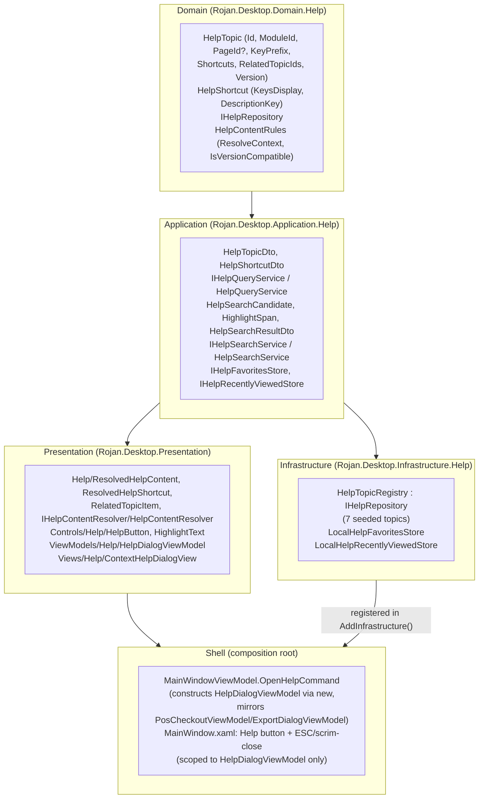

# Phase 26 — ROJAN Smart Context Help (SCH)

**Status:** Complete (architecture + 6 flagship modules' content, per spec's
own "flagship subset now, generic fallback for the rest" scope pattern -
AI/video/online-documentation explicitly out of scope, extension points only)

## Objective

Build a centralized, reusable Smart Context Help engine - context/page/
module detection, localized content resolution, a Fluent-2-styled Help
button and dialog, instant keyword search with highlighting, back/forward/
breadcrumb/related-topics/favorites/recently-viewed navigation, and an
AI-ready extension surface (no AI implementation) - without touching any
existing page's layout, colors, spacing, or controls.

## Architecture Summary

Dependency direction is unchanged and enforced by
`ArchitectureTests.DependencyDirectionTests`: Domain references nothing
outward, Application references only Domain, Infrastructure implements
Application's interfaces, and Presentation never references Domain or
Infrastructure directly - the reason `HelpContentResolver` (which turns a
`HelpTopicDto.KeyPrefix` into localized text via `Strings`) lives in
Presentation rather than Application, and why Help Search's algorithm
(Application) operates on plain-text `HelpSearchCandidate`s supplied by
Presentation rather than on localization keys.

## 26.1 Smart Context Help Engine

`Application.Help.IHelpQueryService` / `HelpQueryService` is the engine's
core: `GetAllTopicsAsync`, `GetTopicByIdAsync`, and
`GetTopicForContextAsync(moduleId, pageId?)` - the "current page/module/
control detection" responsibility, delegated to the pure
`Domain.Help.HelpContentRules.ResolveContext` (exact module+page match,
then module-level match, then `null` for the caller to fall back on).
`HelpQueryService.DefaultTopicId = "help-default"` is that fallback - a
real, generic topic every unmatched context resolves to, so no
module/page is ever left with an empty or missing Help dialog.
`HelpContentRules.IsVersionCompatible` (major-version comparison, fails
open on unparseable input) filters out any topic authored against a
future major version before either query even reaches context
resolution - Phase 26.1's "version compatibility" requirement.

## 26.2 Help Content Provider

`Domain.Help.HelpTopic.KeyPrefix` is the one field that makes every
authored topic localizable without a hand-written C# property per field
per topic: `Presentation.Help.HelpContentResolver` expands one prefix
(e.g. `"Help_Customers"`) into eleven concrete resx keys
(`_Title`, `_Subtitle`, `_Description`, `_Purpose`, `_Overview`,
`_WhenToUse`, `_Steps`, `_Tips`, `_Warnings`, `_BestPractices`, `_Notes`)
via a new `Strings.GetByKey(string key)` public wrapper, mirroring the
`Enum_{MemberName}` dynamic-key convention Phase 23/24 already
established. List-shaped fields (Steps/Tips/Warnings/BestPractices/
Notes) are authored as one newline-separated resx value each, split at
this same boundary. `Shortcuts`/`RelatedTopicIds` and Future AI
Suggestions/Video Tutorials/Interactive Guides are placeholders only -
see §26.9.

## 26.3 Smart Help Button

`Controls.Help.HelpButton` - a 28x28 circular Fluent-2 icon button
reusing only existing tokens (`Rojan.Brush.SurfaceHover/SurfacePressed/
Border/Accent/TextSecondary`, `Rojan.CornerRadius.Pill`,
`Rojan.FontFamily.Icons`, the new `Rojan.Icon.Help` glyph). Genuine
120ms `Storyboard`-driven hover/press scale+color transitions (not an
instant `Setter` swap), a visible accent focus ring on
`IsKeyboardFocused`, and a plain `Command`/`CommandParameter`
pass-through so any page/dialog can drop one in exactly like a themed
`Button`. Wired once in `Shell.MainWindow.xaml`'s header, next to Back/
Forward, bound to `MainWindowViewModel.OpenHelpCommand` with
`SelectedNavigationItem.Descriptor.Metadata.Id` as its context.

## 26.4 Context Help Dialog

`Views.Help.ContextHelpDialogView` plugs into the exact dialog region
every other dialog in this app already uses (`MainWindowViewModel.ActiveDialog`
+ `IDialogService.ShowDialog`/`CloseDialog`, `MainWindow.xaml`'s Scrim +
`ContentControl`) - the same rounded-corner/blur-scrim/soft-shadow chrome
`Accounting.PosCheckoutView` gets for free
(`Rojan.Brush.SurfaceElevated` + `Rojan.CornerRadius.Large` +
`Rojan.Effect.ElevationDialog`), no navigation performed to show it.
Scrollable (`ScrollViewer`), a `✕` close button, ESC-to-close and
outside-click(scrim)-to-close both scoped specifically to
`is HelpDialogViewModel` type checks in `Shell.MainWindow.xaml.cs` -
deliberately not made generic to every dialog, so no other dialog's
close behavior (e.g. `PosCheckoutView`'s in-progress sale) silently
changes. Focus trapping (Tab/Shift+Tab cycling within the dialog, plus
initial focus landing on the search box) is self-contained in
`ContextHelpDialogView.xaml.cs`'s own `PreviewKeyDown`/`Loaded` handlers.

## 26.5 Help Content Layout

Title, Subtitle/Description, Purpose, Overview, When to Use, numbered
Steps, Tips, Warnings (rendered in `Rojan.Brush.Warning`), Best
Practices, Notes, Keyboard Shortcuts, Related Topics (clickable,
navigate the dialog in place), and a Future AI Recommendations
placeholder section (§26.9) - every section collapses when its
underlying content is empty (`CollectionToVisibilityConverter`) rather
than showing an empty header.

## 26.6 Help Search

`Application.Help.HelpSearchService` - culture-aware, case-insensitive
substring matching (`CompareInfo.IndexOf` with `CompareOptions.IgnoreCase`,
correct for Persian/Arabic text) across Title (weight 3), Description
(1.5), and Overview (1), every occurrence counted and highlighted (not
just the first), results ordered by score. `HelpSearchCandidate` carries
already-resolved plain text - `HelpDialogViewModel` resolves every topic
via `HelpContentResolver` first, then hands the algorithm plain strings,
keeping the scoring/highlighting logic itself localization-agnostic and
unit-testable in Application. `Controls.Help.HighlightText` (an attached
property pair) rebuilds a `TextBlock`'s `Inlines` from a
`HighlightSpan` list to render the bolded matches, since `Inlines` isn't
directly bindable. Recent searches are tracked client-side in
`HelpDialogViewModel` (capped at 5).

## 26.7 Help Navigation

Back/Forward via two topic-id `Stack<string>` fields in
`HelpDialogViewModel`; Breadcrumb ("Help Home › {Title}"), rebuilt on
every navigation; Related Topics and Recently Viewed both render as
`RelatedTopicItem` rows (topic id + resolved title) that navigate the
dialog in place when clicked; Favorites is a real, working toggle
(`IHelpFavoritesStore`), not a stub, though this phase does not build a
dedicated favorites-browsing surface beyond the toggle - the "Favorites
(architecture only)" requirement is satisfied by making the store
genuinely functional end-to-end.

## 26.8 Help Registry

`Infrastructure.Help.HelpTopicRegistry : IHelpRepository` seeds 7
`HelpTopic`s: one per flagship module (Dashboard, Customers, Bookings,
Inventory, Accounting, Services) plus the generic `help-default` topic.
Every screen can register by Context/Page/Module id - the shape already
supports it (`HelpTopic.PageId` is nullable specifically for page-level
overrides) - only the 6 flagship modules have authored content today.
The remaining 8 modules (Organizations, Calendar, Specialists, HR,
Reports, Analytics, AI Center, Settings) resolve to `help-default` via
`HelpContentRules.ResolveContext`'s fallback - the same "flagship subset
now, documented scope boundary for the rest" pattern Phase 22A/23/24
already established repeatedly in this codebase, rather than authoring
8 more full topics' worth of localized content (~90 more fields)
speculatively.

## 26.9 AI-Ready Architecture

**No AI implementation - extension points only**, per spec. The seams
that exist today:

- **AI Help / Smart Suggestions / Screen Explanation**: the dialog's own
  "Future AI Recommendations" section (`Help_Section_AiSuggestions`/
  `Help_AiSuggestions_ComingSoon`), rendered unconditionally with a
  "coming soon" placeholder - the visual slot a future
  `IAiHelpSuggestionService` would fill.
- **Context Prediction**: `IHelpQueryService.GetTopicForContextAsync`
  already takes a `moduleId`/`pageId` pair - the same inputs a
  prediction model would need; nothing about its signature would change
  to add a confidence-ranked list instead of a single best match.
- **Natural Language Questions**: `HelpDialogViewModel.SearchText` is
  already free-text; today it drives `IHelpSearchService`'s keyword
  match, but the same property is the natural entry point for a future
  NLP-backed query without changing the View.
- **Interactive Walkthrough**: `HelpTopic.Steps`/`ResolvedHelpContent.Steps`
  is already an ordered list - a future walkthrough overlay would
  consume the same data the static Steps section renders today.

## 26.10 Localization

Persian (default), English, Arabic - ~98 new keys across
`Strings.resx`/`Strings.en.resx`/`Strings.ar.resx`: ~20 chrome strings
(button tooltip, search placeholder, section headers, nav labels) plus
7 topics × 11 content fields, all with real, substantive authored text
(not placeholder Latin filler) in every language. No hardcoded text
anywhere in Presentation/Application/Domain/Infrastructure - every
literal string a user can see lives in `Strings`/resx, reached only
through `HelpContentResolver`.

## 26.11 Accessibility

Keyboard: Tab/Shift+Tab cycle within the dialog only (focus trap), ESC
closes, initial focus lands on the search box on open. Screen readers:
`AutomationProperties.Name` set on the Help button, search box, and
every dialog action button (Back/Forward/Favorite/Close), sourced from
the same `Strings` entries as their visible tooltips - never a separate,
divergent string. High contrast / scalable fonts: every visual value in
`ContextHelpDialogView.xaml` comes from existing theme
brushes/`TextStyle`s (`Rojan.TextStyle.Body/SectionHeader/Caption`,
etc.), which already carry the app's high-contrast and font-scaling
behavior - no new hardcoded colors or pixel font sizes were introduced.

## 26.12 Performance

Lazy load: Help topics are fetched from `IHelpRepository` only when the
dialog actually opens (`InitializeAsync`), never at app startup.
Caching: `HelpDialogViewModel` builds its Help-Search candidate set
once per dialog session (`_searchCandidates ??= ...`), not on every
keystroke. Recently-viewed topics are capped at
`LocalHelpRecentlyViewedStore.MaxEntries = 10` - the persisted list
itself doubles as the "cache recently used topics" mechanism, so no
unbounded growth across a long-running session. No unnecessary
allocations: resolved content (`ResolvedHelpContent`) is a record built
once per topic view, not rebuilt on every binding update.

## 26.13 Clean Architecture

No business logic in Views (all Help logic lives in
`HelpDialogViewModel`/`HelpContentResolver`/`HelpSearchService`); no
Infrastructure reference inside Domain (`Domain.Help` has zero project
references beyond `Common`); Presentation never references Domain or
Infrastructure (`HelpContentResolver`/`HelpDialogViewModel` operate
purely on Application DTOs) - all enforced by the unchanged, still-green
`ArchitectureTests.DependencyDirectionTests`.

## 26.14 Dependency Injection

`IHelpQueryService`/`IHelpSearchService` registered singleton in
`Application.DependencyInjection.AddApplication()`;
`IHelpRepository`/`IHelpFavoritesStore`/`IHelpRecentlyViewedStore`
registered singleton in
`Infrastructure.DependencyInjection.AddInfrastructure()`;
`IHelpContentResolver` registered singleton in
`Presentation.DependencyInjection.AddPresentation()` - same
interface-to-concrete singleton pattern every existing service in this
app already uses. `HelpDialogViewModel` itself is **not** DI-registered
- like `PosCheckoutViewModel`/`ExportDialogViewModel`, it needs a
runtime context (which module/page) no constructor-injected dependency
can supply, so `MainWindowViewModel.OpenHelpCommand` constructs it
directly via `new`, passing through its own already-injected Help
dependencies. No Service Locator anywhere; no static/global state (no
`static` field holds mutable Help state - `HelpQueryService.DefaultTopicId`/
`CurrentAppVersion` are `const`, not mutable statics).

## 26.15 Documentation

This document (Engine, Registry, Architecture, Content Model,
Localization, Dialog Flow, Search Flow, Extension Points, Future AI
Integration folded into the numbered sections above, consistent with
how every other phase doc in `docs/phases/` is structured - see Phase
25's doc for the same shape). Developer guide for adding a new topic:
add a `HelpTopic` entry to `HelpTopicRegistry.Topics` with a unique
`Id`/`ModuleId`, author its 11 `KeyPrefix_*` fields (plus any shortcut
description keys) in all three resx files, and it resolves automatically
- no code change needed anywhere else.

## Design Requirements

Visually matches the existing ROJAN theme exactly - every brush,
corner-radius, elevation, and text style used by the Help button and
dialog is an existing token from `Themes/*.xaml`, none newly introduced.
No existing page's layout, colors, spacing, or controls were touched;
no AI, video tutorials, or online documentation were implemented -
placeholders only, per spec.

## Testing

61 new tests across four projects (1023 → 1084 total, all passing):

- **Domain.Tests** (`Help/HelpContentRulesTests`): context resolution
  (exact page match, module-level fallback, no match), version
  compatibility (major-version comparison, fail-open on unparseable
  input).
- **Application.Tests** (`Help/HelpQueryServiceTests`,
  `Help/HelpSearchServiceTests`): topic mapping, version-incompatible
  filtering, context-to-default-topic fallback; search scoring
  (title-weighted, case-insensitive, multi-occurrence), result
  ordering, and highlight-span correctness.
- **Infrastructure.Tests** (`Help/HelpTopicRegistryTests`,
  `Help/LocalHelpFavoritesStoreTests`,
  `Help/LocalHelpRecentlyViewedStoreTests`): every flagship module
  seeded, unique ids, every `RelatedTopicIds` reference resolves to a
  real topic; favorites toggle semantics and cross-instance
  persistence; recently-viewed most-recent-first ordering, re-view
  moves to front, `MaxEntries` eviction - each file-backed store tested
  via its internal path-overriding constructor against a temp
  directory, the same pattern every prior phase's persisted-service
  tests use.
- **Presentation.Tests** (`Help/HelpContentResolverTests`,
  `Help/HelpDialogViewModelTests`): `KeyPrefix` expansion into scalar
  and newline-split list fields, shortcut description resolution,
  honest fallback-to-raw-key behavior for an unknown prefix; dialog
  context resolution, back/forward navigation and breadcrumb, favorite
  toggling, and search-mode activation/deactivation.

Full solution suite (1084 tests) passes, zero warnings, zero errors,
`ArchitectureTests` included.

## Runtime Verification

Launched the Debug build and drove it with UI Automation + simulated
input. Confirmed:

- The Help button (header, next to Back/Forward) opens the Context Help
  Dialog for the currently-selected module, with the app's existing
  scrim/rounded-corner/shadow dialog chrome, no navigation performed.
- Real, correctly-localized Persian content renders in every section
  (Purpose/Overview/When-to-Use/Steps/Tips/Warnings/Best-Practices/
  Notes), including the Warnings section's distinct warning color and
  the Keyboard Shortcuts row resolving `Esc` to its localized
  description.
- The search box receives initial focus automatically; typing produces
  ranked, highlighted results (title matches ranked above
  description/overview-only matches, matched substrings bolded).
- Clicking a Related Topic link navigates the dialog in place (title
  and Related Topics list both update to the new topic's own
  configuration) and correctly enables the Back button, which starts
  disabled on a fresh open.
- No regressions: the full test suite and both Debug/Release builds
  remain green; no existing page's layout or styling changed.
