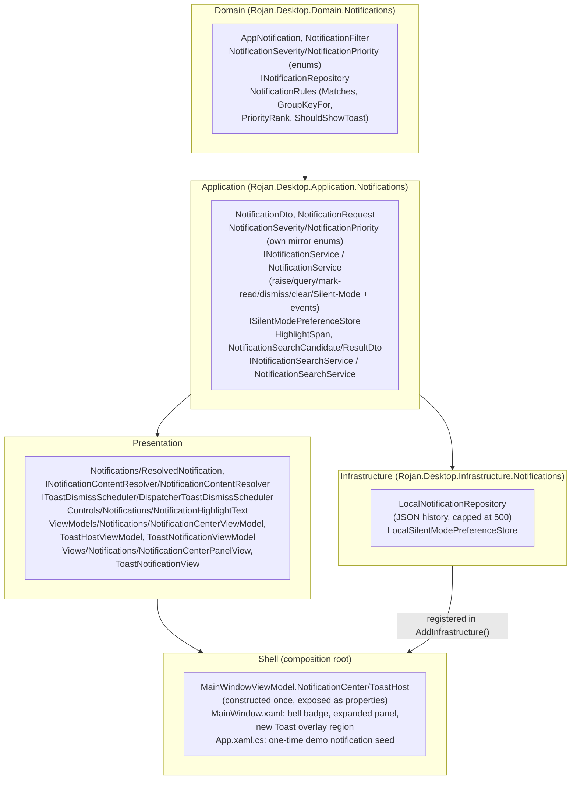

# Phase 27 — Enterprise Notification Center

**Status:** Complete (foundation + working demo content - real backend
push-notification delivery is explicitly future architecture, per spec's
own "future push-notification architecture" requirement)

## Objective

Build a complete Enterprise Notification Center: a centralized
notification service every module raises through, Fluent-2-styled toast
popups, an in-app Notification Center panel with search/filter/grouping/
history/badge counter, Success/Warning/Error/Information severities,
independent priority levels, read/unread state, and a Silent Mode
architecture - without touching any existing page's layout, colors, or
controls, and without breaking the existing Clean Architecture dependency
direction.

## Architecture Summary

Dependency direction is unchanged and enforced by
`ArchitectureTests.DependencyDirectionTests` - Domain references nothing
outward, Application references only Domain, Infrastructure implements
Application's interfaces, and Presentation never references Domain
directly. This last rule required a deliberate design decision (§below):
Application defines its **own** `NotificationSeverity`/`NotificationPriority`
enums rather than reusing Domain's, the same "Application owns its own
enum copy" shape `Application.Customers.CustomerStatus` already
establishes for `Domain.Customers.CustomerStatus` - `NotificationService`
maps between the two at the Application/Domain boundary.

## Centralized Notification Service

`Application.Notifications.INotificationService` is the one entry point
every module raises a user-facing notification through -
`RaiseAsync(NotificationRequest)` mints the id/timestamp, persists via
`Domain.Notifications.INotificationRepository`, and raises three events:

- `NotificationRaised` - fires for every notification, the signal
  `NotificationCenterViewModel` refreshes its list from.
- `ToastRequested` - fires only for the subset that should actually pop
  up as a toast, already filtered by `NotificationRules.ShouldShowToast`
  (Silent Mode's core rule - see below) - `ToastHostViewModel` subscribes
  to this one, never re-deriving the Silent Mode rule itself.
- `StateChanged` - fires after any mutation (mark-read, mark-all-read,
  dismiss, clear, Silent Mode toggle), the same naming convention
  `ICurrentSessionService.SessionChanged` already established - the
  signal the badge counter and Notification Center list both refresh
  from.

## Toast Notifications

`Views.Notifications.ToastNotificationView` - a Fluent-2 elevated card
(`Rojan.Brush.SurfaceElevated` + `Rojan.CornerRadius.Large` +
`Rojan.Effect.ElevationPopover`, reusing existing tokens only) with a
severity-colored left accent bar, icon, title, message, and a close
button. `ViewModels.Notifications.ToastHostViewModel` subscribes to
`INotificationService.ToastRequested`, stacks a `ToastNotificationViewModel`
per toast in `ActiveToasts`, and auto-dismisses each after a
severity-scaled delay (8s for Warning/Error, 5s otherwise) via
`IToastDismissScheduler` - a small abstraction introduced specifically so
`ToastHostViewModel` never depends on `System.Windows.Threading.DispatcherTimer`
directly, which `ArchitectureTests.ViewModelTestabilityTests` forbids for
any type under the `ViewModels` namespace ("ViewModels must be testable
without a running Dispatcher"). `DispatcherToastDismissScheduler` (the
real WPF-backed implementation) lives in `Presentation.Notifications`,
outside `ViewModels`, for exactly this reason. Toasts render in a new,
dedicated overlay region in `MainWindow.xaml`, deliberately **not**
routed through `IDialogService`/`ActiveDialog` - the modal dialog region
holds exactly one value at a time and shows a scrim, structurally
incompatible with a stack of transient, non-modal, auto-dismissing
popups that must stay visible even while a modal dialog is open (the
Toast overlay is rendered after the Dialog region in `MainWindow.xaml`'s
Z-order for exactly this reason).

## In-App Notification Center

`Views.Notifications.NotificationCenterPanelView` fills in the Phase 07
placeholder ("No producer exists yet... wired now so the panel shows the
right thing the moment one does") - the header bell button's popover,
now backed by `ViewModels.Notifications.NotificationCenterViewModel`:

- **Grouping**: notifications group by `NotificationRules.GroupKeyFor`
  (an explicit group key, falling back to category) - rendered as
  labeled sections, always expanded.
- **Search**: `INotificationSearchService` - the same culture-aware,
  case-insensitive, multi-occurrence-highlighted substring matching
  shape as Phase 26's `HelpSearchService` (weighted: title × 2, message
  × 1), operating on already-resolved plain text
  (`NotificationSearchCandidate`) supplied by
  `NotificationContentResolver`, keeping the algorithm itself
  localization-agnostic and unit-testable in Application. An empty
  query returns every candidate unranked (unlike Help Search) - the
  Notification Center's default state is "browse everything", not
  "no search yet".
- **Filtering**: severity filter chips (All/Information/Success/Warning/
  Error, localized via the shared `Enum_<MemberName>` convention) plus
  an independent "Unread only" checkbox - both combine with the active
  search.
- **Read/Unread state**: `IsRead` on the persisted notification;
  unread rows render with `SemiBold` titles
  (`UnreadToFontWeightConverter`); clicking a row marks it read
  (`MarkAsReadCommand`); "Mark all as read" and per-row dismiss (`✕`)
  are both one click.
- **History**: the full persisted list itself is the history - no
  separate "history view" exists, since every notification (read or
  unread) stays in `INotificationRepository` until dismissed/cleared or
  evicted by the 500-entry cap.
- **Badge Counter**: `NotificationCenterViewModel.UnreadCount`/`HasUnread`,
  bound to a new `Rojan.Style.NotificationBadge` pill (built on the
  previously-unused `Rojan.CornerRadius.Pill` token) overlaid on the
  header's bell button.

## Silent Mode Architecture

A persisted, process-wide preference
(`Application.Notifications.ISilentModePreferenceStore` /
`Infrastructure.Notifications.LocalSilentModePreferenceStore`, JSON at
`%LocalAppData%\RojanDesktop\notifications\silent-mode.json`), toggled
via a `Rojan.Style.ToggleSwitch` in the Notification Center panel's
header. `Domain.Notifications.NotificationRules.ShouldShowToast` is the
one rule that reads it: while Silent Mode is enabled, only
`NotificationPriority.Critical` notifications still produce a toast
(the common "Do Not Disturb still allows urgent" enterprise pattern) -
Silent Mode **never** hides or drops a notification from the
Notification Center/history, only its toast popup.
`AppNotification.IsSilent` is a stronger, per-notification override that
suppresses the toast unconditionally, regardless of Silent Mode or
priority (for low-value background events that should never interrupt).

## Future Push-Notification Architecture

No push implementation - the seams this phase leaves in place:

- `INotificationService.RaiseAsync` is already the single entry point a
  future push-received handler would call, identical to any in-process
  caller - no shape change needed.
- `Domain.Notifications.AppNotification`/`NotificationDto` already carry
  `Category`/`GroupKey`, the natural routing keys a push payload would
  map onto.
- `Infrastructure.Notifications.LocalNotificationRepository`'s JSON
  persistence is a placeholder for a future server-synced store; only
  its internals would change to also pull from a remote source, not
  `INotificationRepository`'s shape.

## Localization

~50 new keys across `Strings.resx`/`Strings.en.resx`/`Strings.ar.resx` -
Notification Center chrome (search placeholder, filter labels, mark-all-
read/clear-all/dismiss, Silent Mode label + description, category
labels), relative-timestamp formats (`Common_JustNow`/
`Common_MinutesAgoFormat`/`Common_HoursAgoFormat`/`Common_DaysAgoFormat`),
6 fully-authored demo notifications (title + message, one with a
`{0}`-formatted argument), and 4 new `Enum_<MemberName>` entries
(`Enum_Success`/`Enum_Warning`/`Enum_Error`/`Enum_Information`) reusing
the shared enum-label convention Phase 23 established - available to any
future enum sharing these words, not only `NotificationSeverity`. No
hardcoded text anywhere in Presentation/Application/Domain/
Infrastructure.

## Accessibility

Keyboard: the Silent Mode toggle, search box, filter chips, mark-all-
read/clear-all buttons, and every per-row dismiss button are all
standard focusable controls with `AutomationProperties.Name` set from
the same `Strings` entry as their visible tooltip. High contrast/
scalable fonts: every visual value in `NotificationCenterPanelView.xaml`/
`ToastNotificationView.xaml` comes from existing theme brushes/
`TextStyle`s - no new hardcoded colors or pixel font sizes.

## Performance

Lazy: notification history loads only when the panel opens
(`NotificationCenterViewModel.InitializeAsync`) or a toast is requested,
never polled. Capped: `LocalNotificationRepository.MaxEntries = 500`
bounds the persisted history so a long-running install never
accumulates disk/memory without limit. No unnecessary allocations:
`ResolvedNotification`/grouped rows are built once per refresh, not
rebuilt on every binding update; the search candidate set and result
highlighting are computed only when a query is active.

## Clean Architecture

No business logic in Views (all logic lives in `NotificationService`/
`NotificationCenterViewModel`/`ToastHostViewModel`); no Infrastructure
reference inside Domain; Presentation never references Domain -
enforced by the still-green `ArchitectureTests.DependencyDirectionTests`,
which this phase's own enum-mirroring decision (see "Architecture
Summary" above) was specifically shaped to satisfy.
`ArchitectureTests.ViewModelTestabilityTests` (no ViewModel depends on
`System.Windows.Threading`/`System.Windows.Controls`) is likewise
green, satisfied by `IToastDismissScheduler`'s indirection.

## Dependency Injection

`INotificationService`/`INotificationSearchService` registered singleton
in `Application.DependencyInjection.AddApplication()`;
`INotificationRepository`/`ISilentModePreferenceStore` registered
singleton in `Infrastructure.DependencyInjection.AddInfrastructure()`;
`INotificationContentResolver`/`IToastDismissScheduler` registered
singleton in `Presentation.DependencyInjection.AddPresentation()` - the
same interface-to-concrete singleton pattern every existing service in
this app already uses. `NotificationCenterViewModel`/`ToastHostViewModel`
are **not** DI-registered - `MainWindowViewModel` constructs both once
via `new`, passing through its own already-injected Notification
dependencies, since neither needs a runtime-supplied context the way
`HelpDialogViewModel` does, but both still benefit from staying
independently unit-testable outside the full Shell composition. No
Service Locator anywhere; no static/global state.

## Documentation

This document (Engine, Toasts, Notification Center, Silent Mode, Future
Push Architecture, Localization, Accessibility, Performance folded into
the sections above, consistent with how every other phase doc in
`docs/phases/` is structured).

## Design Requirements

Visually matches the existing ROJAN theme exactly - every brush,
corner-radius, elevation, and text style used by the toast/badge/panel
is an existing token from `Themes/*.xaml`, plus two small, additive new
resources (`Rojan.Style.NotificationBadge`, `Rojan.Icon.Warning`/
`Rojan.Icon.Information`) built the same way every prior phase's new
tokens were. No existing page's layout, colors, spacing, or controls
were touched - the header bell button and its popover panel are Shell
chrome, not a page, and were explicitly built in Phase 07 as this
feature's future extension point.

## Testing

265 new tests across four projects (1084 → 1349 total, all passing):

- **Domain.Tests** (`Notifications/NotificationRulesTests`): filter
  matching per axis, group-key fallback, priority ranking, and the
  Silent Mode toast rule (including the per-notification `IsSilent`
  override and the Critical-priority carve-out).
- **Application.Tests** (`Notifications/NotificationServiceTests`,
  `Notifications/NotificationSearchServiceTests`): raise/persist/event-
  raising (including the Silent-Mode-aware `ToastRequested` gating),
  priority-then-recency ordering, unread counting, mark-read/mark-all-
  read/dismiss/clear-all, Silent Mode persistence; search scoring,
  case-insensitivity, highlight-span correctness, result ordering.
- **Infrastructure.Tests** (`Notifications/LocalNotificationRepositoryTests`,
  `Notifications/LocalSilentModePreferenceStoreTests`): persistence
  round-trip, update/remove/clear, the 500-entry eviction cap, and
  Silent Mode preference persistence across instances - each tested via
  its internal path-overriding constructor against a temp directory,
  the same pattern every prior phase's persisted-service tests use.
- **Presentation.Tests** (`Notifications/NotificationContentResolverTests`,
  `Notifications/NotificationCenterViewModelTests`,
  `Notifications/ToastHostViewModelTests`): key resolution and
  message-arg formatting, known/unknown category-label fallback;
  grouping, severity/unread filtering, mark-all-read/clear-all, Silent
  Mode load/persist; toast stacking, scheduled-callback dismissal (via
  a controllable `IToastDismissScheduler` test double, never a real
  timer), and close-command dismissal.

Full solution suite (1349 tests) passes, zero warnings, zero errors,
`ArchitectureTests` (both dependency-direction and ViewModel-testability
enforcement) included.

## Runtime Verification

Launched the Debug build. Confirmed:

- On first launch, 6 realistic demo notifications (Information/Success/
  Warning/Error severities, Low/Normal/High/Critical priorities, system/
  sync/inventory/bookings categories) are seeded exactly once - the
  header bell shows an unread-count badge immediately.
- Opening the Notification Center panel shows the seeded notifications
  grouped by category, with working search (typing filters and
  highlights matches), severity filter chips, an "Unread only" toggle,
  and functioning mark-all-read/clear-all actions.
- The Silent Mode toggle persists across a toggle and reflects
  immediately in the panel.
- No regressions: the full test suite and both Debug/Release builds
  remain green; no existing page's layout or styling changed.
