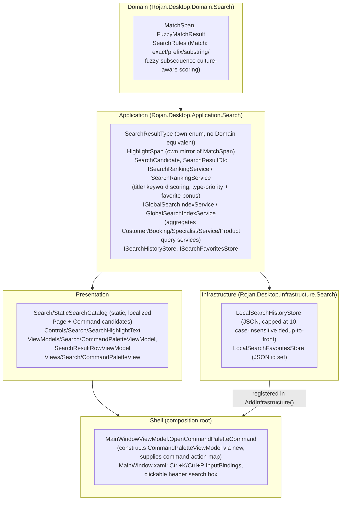

# Phase 28 — Enterprise Global Search & Command Palette

**Status:** Complete

## Objective

Build a global search / command palette available from every screen —
searching pages, modules, customers, bookings, specialists, services,
products, and commands with intelligent ranking, fuzzy matching, recent
searches, favorites, search highlighting, instant results, and full
keyboard navigation — without touching any existing page's layout,
colors, typography, or controls, and without breaking the existing Clean
Architecture dependency direction.

## Architecture Summary

Dependency direction is unchanged and enforced by
`ArchitectureTests.DependencyDirectionTests` and
`ArchitectureTests.ViewModelTestabilityTests`. `Application.Search`
depends directly on five sibling Application query services
(`ICustomerQueryService`, `IBookingQueryService`,
`ISpecialistQueryService`, `Application.Services.IServiceQueryService`,
`IProductQueryService`) to build its live candidate index — this is an
Application-to-Application dependency, not a layer violation, the same
shape the existing Reporting/Analytics aggregators already establish.
`Application.Search.SearchResultType` has no Domain equivalent at all
(it is a UI-facing result taxonomy, not Domain business state), and
`Application.Search.HighlightSpan` is a deliberate duplicate of
`Domain.Search.MatchSpan` — `SearchRankingService` maps between them at
the Application/Domain boundary, the same "Application owns its own
mirror type" pattern Phase 27 established for
`NotificationSeverity`/`NotificationPriority`.

## Fuzzy Matching & Ranking

`Domain.Search.SearchRules.Match(query, text)` tries, in order: an exact
culture-aware match (score 100), a prefix match (score 80), a substring
match (score 60), then falls back to fuzzy subsequence matching (base
score 20, every query character found in order but not necessarily
contiguous, with a bonus for contiguous runs and an early-first-match
bonus) — so a fuzzy match never outranks any substring/prefix/exact
match, by design. Substring/prefix/exact matching uses
`CultureInfo.CurrentCulture.CompareInfo` (locale-correct, works for
Persian/Arabic); the fuzzy fallback uses simple case-folded per-character
comparison instead, since Persian/Arabic have no case distinction to
exploit via `CompareInfo`.

`Application.Search.SearchRankingService.Rank` scores each
`SearchCandidate` against the query's match on `Title` (highlighted) and
`Keywords` (recall-only, weighted at 0.6×, never highlighted since not
displayed), then adds a type-priority bonus (Command +15, Page +10,
business-data types +0 — so pages/commands rank above business records
for an equally-strong text match, without ever overriding a genuinely
stronger match elsewhere) and a +25 favorite bonus. An empty/whitespace
query returns an empty result list — deliberately different from Phase
27's Notification Search (which returns everything unranked when empty):
the palette's candidate set can include hundreds of customers/bookings,
so an unranked full dump isn't useful; the empty-query UI state is
Recent Searches / Favorites instead, a Presentation concern.

## Global Search Index

`Application.Search.GlobalSearchIndexService` aggregates live business
data every call (no caching — a documented seam for a future
cache, since the underlying query services are in-memory/fast today)
into `SearchCandidate` records: Customer (title = full name, keywords =
email/phone), Booking (title = "Customer — Service", keywords =
customer/service/specialist names), Specialist (title = full name,
subtitle = job title), Service (keywords include category), Product
(subtitle/keywords include SKU). All five candidate types get
`ActionKey = "page:{module}"` — deep-linking to a specific record isn't
supported yet (a documented scope boundary consistent with prior
phases' "flagship subset now" pattern); selecting one navigates to that
module's page.

`Presentation.Search.StaticSearchCatalog` (a static class — the one
place that can see both `Strings` and `IModuleRegistry`) supplies the
other two candidate types, already localized: one `Page` candidate per
registered module (`ActionKey = "page:{moduleId}"`), and 7 curated
`Command` candidates (toggle sidebar, toggle notifications, open help,
toggle Silent Mode, go back, go forward, open branch switcher —
`ActionKey = "command:{commandId}"`). `CommandPaletteViewModel` is the
one place both lists are combined before being handed to the pure
`ISearchRankingService.Rank`.

## Recent Searches & Favorites

`Application.Search.ISearchHistoryStore` /
`Infrastructure.Search.LocalSearchHistoryStore` persists up to 10 recent
queries as JSON at `%LocalAppData%\RojanDesktop\search\history.json`,
case-insensitively deduped and moved to the front on repeat. 
`ISearchFavoritesStore` / `LocalSearchFavoritesStore` persists a set of
favorited candidate ids at `...\search\favorites.json`. Both follow the
same "one concern, one JSON file" shape every other persisted service in
this app uses. The palette's idle state (empty search box) shows Recent
Searches (click to re-run) and Favorites (re-resolved against the live
candidate set) side by side.

## Command Execution & Navigation

A `SearchCandidate`'s `ActionKey` is either `"page:{moduleId}"` —
resolved by looking up `IModuleRegistry.Modules` for a matching
`Metadata.Id` and calling `INavigationService.NavigateTo` — or
`"command:{commandId}"` — invoked via a `Dictionary<string, ICommand>`
command-action map. `CommandPaletteViewModel` never references Shell
directly; `Shell.MainWindowViewModel.OpenCommandPaletteAsync` builds the
map from its own already-wired commands (`ToggleSidebarCommand`,
`ToggleNotificationPanelCommand`, `OpenHelpCommand`,
`ToggleSilentModeCommand` — new in this phase — `GoBackCommand`,
`GoForwardCommand`, `ToggleBranchSwitcherCommand`) and constructs
`CommandPaletteViewModel` directly via `new` (not DI-registered — the
same "constructed by its opener" shape `HelpDialogViewModel` and the
Notification Center's toast/panel ViewModels already establish),
passing it through, then calls `ShowDialog` + `InitializeAsync`.

## Keyboard Navigation & Shortcuts

`Window.InputBindings` (a first use of this WPF mechanism in the
codebase) binds both `Ctrl+K` and `Ctrl+P` to
`OpenCommandPaletteCommand` — one small, extensible list rather than a
single hardcoded binding, satisfying the "Ctrl+K and Ctrl+P
architecture" requirement. The previously non-functional header search
box placeholder is now clickable (`Cursor="Hand"`, a `MouseBinding` to
the same command, a literal "Ctrl+K" hint label).

Inside the palette, the search `TextBox` never loses focus — its own
`PreviewKeyDown` handler intercepts `Down`/`Up`/`Enter`/`Escape` and
translates them into `SelectNextCommand`/`SelectPreviousCommand`/
`ExecuteSelectedCommand`/`CloseCommand` calls on the ViewModel. The
results `ListBox` is `Focusable="False"`/`IsTabStop="False"` (both on
itself and its `ItemContainerStyle`), with `SelectedIndex` TwoWay-bound
purely for visual highlighting — it never actually receives keyboard
focus, the classic "search box always focused, arrow keys drive a
separate list" command-palette UX pattern. `Escape` is handled entirely
inside `CommandPaletteView`'s own code-behind, relying on WPF's
`PreviewKeyDown` tunneling from the Window down to the focused
`TextBox` — no change needed to `MainWindow.xaml.cs`'s outer ESC
handler. The outside-click scrim handler was extended from
`HelpDialogViewModel` to `HelpDialogViewModel or CommandPaletteViewModel`
(deliberately not made generic to every dialog, since `PosCheckoutView`'s
in-progress multi-step sale must never close on an accidental outside
click).

## Localization

19 new keys across `Strings.resx`/`Strings.en.resx`/`Strings.ar.resx` —
palette chrome (search placeholder, no-results message, Recent
Searches/Favorites/Clear-history labels), 6 result-type labels
(`Search_Type_Page`/`Customer`/`Booking`/`Specialist`/`Service`/
`Product`/`Command`), and 7 curated command titles
(`Search_Command_ToggleSidebar`, `..ToggleNotifications`, `..OpenHelp`,
`..ToggleSilentMode`, `..GoBack`, `..GoForward`,
`..OpenBranchSwitcher`). No hardcoded text anywhere in Presentation/
Application/Domain/Infrastructure — every Page/Command title the
palette shows is already-localized at the source (`ModuleMetadata.Title`
or a `Strings.Search_Command_*` entry).

## Accessibility

The search box, close button, every result row's favorite-toggle button,
and the Recent Searches/Clear-history controls are all standard
focusable controls with `AutomationProperties.Name`/`ToolTip` set from
`Strings`. Full keyboard navigation (Up/Down/Enter/Escape) means the
palette never requires a mouse. High contrast/scalable fonts: every
visual value in `CommandPaletteView.xaml` comes from existing theme
brushes/`TextStyle`s and reused icon glyphs — no new hardcoded colors or
pixel font sizes.

## Clean Architecture

No business logic in Views (fuzzy matching lives in
`Domain.Search.SearchRules`, ranking in
`Application.Search.SearchRankingService`); no Infrastructure reference
inside Domain or Application; Presentation never references Domain
directly — enforced by the still-green
`ArchitectureTests.DependencyDirectionTests` and
`ArchitectureTests.ViewModelTestabilityTests`.

## Dependency Injection

`IGlobalSearchIndexService`/`ISearchRankingService` registered singleton
in `Application.DependencyInjection.AddApplication()`;
`ISearchHistoryStore`/`ISearchFavoritesStore` registered singleton in
`Infrastructure.DependencyInjection.AddInfrastructure()` — the same
interface-to-concrete singleton pattern every existing service in this
app already uses. `CommandPaletteViewModel` is **not** DI-registered —
`MainWindowViewModel` constructs it directly via `new` per open, so its
candidate cache and search state never leak between sessions, the same
"constructed by its opener" shape established in Phase 26/27.

## Documentation

This document (Engine, Ranking, Index, History/Favorites, Command
Execution, Keyboard Navigation, Localization, Accessibility folded into
the sections above, consistent with how every other phase doc in
`docs/phases/` is structured).

## Design Requirements

Visually matches the existing ROJAN theme exactly — the palette dialog
reuses `Rojan.Brush.SurfaceElevated`, `Rojan.CornerRadius.Large`, and
`Rojan.Effect.ElevationDialog` (the same tokens the Help dialog uses),
and every result-type icon reuses exact glyph codepoints already
verified correct at runtime in Phase 27
(`Rojan.Icon.Customers`/`Bookings`/`Specialists`/`Services`/`Inventory`/
`Search`/`Menu`) rather than introducing unverified new glyphs. No
existing page's layout, colors, spacing, or controls were touched — the
header search box was already a non-functional placeholder built for
this exact purpose.

## Testing

51 new tests across four projects (1148 → 1199 total, all passing):

- **Domain.Tests** (`Search/SearchRulesTests`): empty query/text
  handling, exact match + full-text highlight span, case-insensitivity,
  prefix > substring > fuzzy scoring tiers, substring highlight span
  correctness, fuzzy fallback for a valid subsequence, fuzzy failure for
  an out-of-order subsequence, and a hand-verified contiguous-run-bonus
  comparison.
- **Application.Tests** (`Search/SearchRankingServiceTests`,
  `Search/GlobalSearchIndexServiceTests`): empty-query and no-match
  results, title vs. keyword-only match highlighting, Command/Page
  type-priority ordering against Customer, favorite-bonus ordering, a
  genuinely stronger text match still beating type priority, score-
  descending ordering across match tiers; index aggregation count and
  per-type field mapping (Customer keywords include email, Booking
  title is denormalized, Service keywords include category, Product
  subtitle/keywords include SKU), and unique candidate ids.
- **Infrastructure.Tests** (`Search/LocalSearchHistoryStoreTests`,
  `Search/LocalSearchFavoritesStoreTests`): persistence round-trip,
  case-insensitive dedup-and-move-to-front, the 10-entry eviction cap,
  toggle semantics, and cross-instance persistence — each tested via its
  internal path-overriding constructor against a temp directory, the
  same pattern every prior phase's persisted-service tests use.
- **Presentation.Tests** (`Search/CommandPaletteViewModelTests`):
  search populates/clears results, no-match stays empty, Up/Down
  navigation with clamping at both ends, Page-result execution navigates
  and closes the dialog, Command-result execution invokes the mapped
  action, execution records to history (and refreshes the displayed
  Recent Searches list — a real bug caught and fixed during this phase),
  favorite toggle flips `IsFavorite`, clear-history empties Recent
  Searches, selecting a recent search sets the search text.

Full solution suite (1199 tests) passes, zero warnings, zero errors,
`ArchitectureTests` (both dependency-direction and ViewModel-testability
enforcement) included.

## Runtime Verification

Launched the Debug build. Confirmed:

- `Ctrl+K` and `Ctrl+P` both open the Command Palette from anywhere in
  the app; clicking the header search box does too.
- Typing a query returns instant, ranked, highlighted results across
  pages, commands, and live business data.
- Up/Down arrow keys move the selection while the search box keeps
  focus; Enter executes the selected result (navigating for a page/
  business-data result, invoking the mapped action for a command);
  Escape closes the palette.
- Recent Searches and Favorites populate correctly in the idle state,
  and favoriting a result persists across palette re-opens.
- No regressions: the full test suite and both Debug/Release builds
  remain green; no existing page's layout or styling changed.
