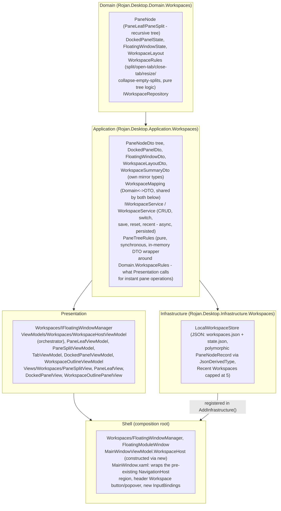

# Phase 29 — Enterprise Workspace & Window Management

**Status:** Complete

## Objective

Build a complete workspace/window-management system — multi-workspace
support, dockable panels, floating windows, split view, tab management,
workspace save/restore with last-workspace-on-startup, recent workspaces,
reset workspace, keyboard shortcuts, and full Fluent 2/localization/
accessibility parity — layered additively on top of the existing,
sidebar-driven single-content shell (unchanged since Phase 07), without
touching any of the 14 existing module pages' layout, colors, typography,
or controls, and without breaking the existing Clean Architecture
dependency direction.

## Architecture Summary

Dependency direction is unchanged and enforced by
`ArchitectureTests.DependencyDirectionTests`/`ViewModelTestabilityTests`.
`Application.Workspaces` owns a full parallel mirror of every Domain type
(`PaneOrientation`, `DockSide`, `PaneNodeDto`, `DockedPanelDto`,
`FloatingWindowDto`, `WorkspaceLayoutDto`) — the same "Application owns its
own copy so Presentation never needs a Domain reference" pattern Phase
27/28 established for `NotificationSeverity`/`HighlightSpan` — with the
translation centralized once in `WorkspaceMapping`, shared by both
`WorkspaceService` (async, persisted) and the new `PaneTreeRules` (pure,
synchronous, in-memory).

## Why Two Rule Engines Look Alike But Aren't Duplicated

`Domain.Workspaces.WorkspaceRules` is the single canonical implementation
of split/open-tab/close-tab/resize/collapse-empty-split logic, operating
on `PaneNode`. `Application.Workspaces.PaneTreeRules` is not a second
implementation — it is a thin, fully mechanical wrapper that maps a
`PaneNodeDto` to `PaneNode` via `WorkspaceMapping`, calls
`WorkspaceRules`, and maps the result back. This exists because
`WorkspaceHostViewModel` (Presentation) cannot reference `Domain` directly
(`ArchitectureTests.DependencyDirectionTests`), but every interactive pane
operation still needs to run **instantly, synchronously, with no I/O** —
routing every click/drag through `IWorkspaceService`'s async,
repository-backed methods would mean a round trip to disk on every
keystroke-equivalent gesture. `PaneTreeRules` is what lets
`WorkspaceHostViewModel` mutate its in-memory tree immediately and persist
the result afterward via a separate, decoupled
`IWorkspaceService.SaveLayoutAsync` call — the same "compute in memory,
persist separately" shape the rest of this app already uses for anything
latency-sensitive.

## Pane Tree Model

The secondary-pane tree is a binary tree (`PaneNode` = `PaneLeaf` |
`PaneSplit`), deliberately separate from the **primary pane** — the
pre-existing, sidebar-driven, `NavigationService`-backed content region
that has been unchanged since Phase 07. `WorkspaceLayout.SecondaryRoot`
being `null` (the default, and what a fresh install/Reset Workspace
produces) means "no extra panes at all" — the app then renders
byte-for-byte identically to every prior phase, since the primary pane's
own rendering path was never touched.

Splitting for the first time (`WorkspaceRules.Split` with a `null` root)
captures whatever the primary pane is currently showing as the split's
first child, so the user's context isn't discarded. All further splits
happen **within** the secondary region and support both orientations
(`Split Right`/`Split Down`); the primary-vs-secondary boundary itself is
always a plain horizontal split with a live (session-only, not persisted)
ratio via a `GridSplitter` — a deliberate, documented scope trim, whereas
every *nested* split's ratio **is** persisted (`PaneSplitDto.Ratio`,
round-tripped through `WorkspaceLayoutDto`).

## Tab Management

Each `PaneLeaf`/`PaneLeafViewModel` holds an ordered list of open module
tabs plus one active tab. `WorkspaceHostViewModel` caches live
`PaneLeafViewModel`/`TabViewModel` instances by id
(`_leafCache`/`_tabCache`), pruned against the current tree after every
structural change (`PruneCaches`) — a structural change elsewhere in the
tree (e.g. splitting a different pane) never discards or recreates an
unrelated tab's content ViewModel, so in-progress state (scroll position,
a partially-filled form) survives. A pane's tab strip ("+"button, powered
by `PaneLeafViewModel.AddTabCommand` and a module picker menu built from
`IModuleRegistry`) can open **any** of the 14 registered modules as a new
tab — module page content is resolved via the exact same
`ModuleDescriptor.CreateViewModel(IServiceProvider)` + implicit
DataTemplate-by-ViewModel-type mechanism `NavigationService` already uses
for the primary pane, so no module's View or ViewModel needed any change
at all.

## Docked Panels

`DockedPanelState`/`DockedPanelDto`/`DockedPanelViewModel` model a pinned
side panel generically (`PanelKey`, `Side`, `Size`, `IsVisible`) — but
only one panel exists today, the flagship **Workspace Outline**: a live
list of every open tab across every secondary pane plus every floating
window, click to focus, click to close (`WorkspaceOutlineViewModel`,
rendered by `WorkspaceOutlinePanelView`). It docks to the right of the
workspace region, collapsed (0-width) by default via
`DockedPanelViewModel.EffectiveSize` (a plain `IsVisible ? Size : 0`
computed property feeding a `DoubleToGridLengthConverter`) — no separate
visibility trigger needed. Toggled via the header Workspace popover's
"Toggle Outline Panel" action or the command palette. Left/Bottom dock
sides are modeled in Domain/Application for forward compatibility but
have no reachable UI trigger in this phase — a documented "flagship
subset now" boundary, the same pattern Phase 24/26 already established
for other subsystems.

## Floating Windows

`Presentation.Workspaces.IFloatingWindowManager` (concrete
`Shell.Workspaces.FloatingWindowManager`) opens a module in a real,
independent `Window` (`FloatingModuleWindow` — the same custom-WindowChrome
idiom `MainWindow` uses, a shorter caption, no manual theme merge needed
since `Shell.Theming.ThemeResources` already merges the whole design
system into `Application.Resources` at startup). "Float Out" removes the
tab from its pane (collapsing an emptied leaf/split the same way closing
a tab does) and opens/tracks the floating window; closing a floating
window (either via its own title bar or from the Workspace Outline) fires
`WindowClosed`, which `WorkspaceHostViewModel` listens for to drop it from
the saved layout. `IFloatingWindowManager.GetGeometry` reads a window's
**current** position/size (its `RestoreBounds` if maximized) just before
saving, so a workspace remembers a floating window's actual final geometry
rather than wherever it was first opened.

## Named Workspaces, Save/Restore, Recent, Reset

`IWorkspaceService.EnsureInitializedAsync` is the one bootstrap entry
point: on a truly first launch it creates and activates a "Default"
workspace; on every subsequent launch it restores whichever workspace was
last active — the "Restore last workspace on startup" requirement.
`WorkspaceHostViewModel.InitializeAsync` calls this *after* the primary
pane has already navigated to its normal default module (via the
pre-existing Phase 07 `SelectedNavigationItem` mechanism); if the restored
workspace's primary module differs, `PrimaryModuleChangeRequested` fires
and `MainWindowViewModel` re-points `SelectedNavigationItem` — the one
place these two independently-evolved subsystems (Phase 07 navigation,
Phase 29 workspaces) touch.

Every structural pane/dock mutation triggers a best-effort
`SaveLayoutAsync` afterward (fire-and-forget from the UI's perspective,
since the mutation itself already applied instantly via `PaneTreeRules`).
The header Workspace popover exposes full CRUD (create/rename/duplicate/
delete/switch), a **Recent Workspaces** section (most-recently-switched-to
first, capped at 5, `LocalWorkspaceStore`), and **Reset Workspace**
(clears secondary panes/docked panels/floating windows back to the
single-primary-pane default, keeping the workspace's name/id). Deleting
the only remaining workspace is rejected
(`IWorkspaceService.DeleteWorkspaceAsync` throws
`InvalidOperationException`) and the switcher's Delete button is
`CanExecute`-guarded against it — there must always be at least one
workspace.

## Keyboard Shortcuts

Extends the one `Window.InputBindings` list Phase 28 introduced (Ctrl+K/
Ctrl+P) rather than inventing a second mechanism:

| Shortcut | Action |
|---|---|
| `Ctrl+Shift+D` | Split Right (focused pane, or primary if none focused) |
| `Ctrl+Shift+J` | Split Down |
| `Ctrl+W` | Close the focused pane's active tab |
| `Ctrl+Shift+F` | Float out the focused pane's active tab |
| `Ctrl+Tab` / `Ctrl+Shift+Tab` | Cycle to next/previous tab in the focused pane |
| `Ctrl+Shift+W` | Open/close the Workspace switcher popover |
| `Ctrl+Shift+R` | Reset the active workspace |

All bind to `WorkspaceHostViewModel`'s own commands directly (no new
`MainWindowViewModel` command wrappers needed) — `FocusedLeafId` (set by
a pane's own click handler) is what "focused pane" tracks; `null` (no
pane ever clicked) means these fall back to acting on the primary pane's
module.

## Integration With the Primary Pane (Why This Is Safe)

The single highest-risk part of this phase was touching `MainWindow.xaml`'s
body region without destabilizing 14 existing modules' rendering, every
dialog, every overlay (Notification Center, toasts, Command Palette,
branch switcher). The integration is strictly additive:

- `NavigationHost` — the exact `ContentControl` `NavigationService.Attach`
  wires in `MainWindow.xaml.cs`'s constructor — is **untouched**, same
  name, same binding, just relocated one `Grid` level deeper.
- The new secondary-pane column and the new Workspace Outline dock column
  are both zero-width by default (`HasSecondaryPane`/`OutlinePanel.IsVisible`
  both `false` until the user acts), via
  `BoolToGridLengthConverter`/`DoubleToGridLengthConverter` — a workspace
  that has never been split or docked renders pixel-identical to Phase 28.
- The header gained exactly one new button/popover (the same
  trigger-Button-plus-Popup chrome the Branch Switcher already
  established), inserted as one new `Auto` column — no existing header
  element's position/size changed beyond a `Grid.Column` renumber.
- `WorkspaceHostViewModel` is constructed via `new` inside
  `MainWindowViewModel`'s constructor (not DI-registered) — the same
  "constructed by its opener, lives for the app's lifetime" shape
  `NotificationCenterViewModel`/`ToastHostViewModel` already establish.

## Localization

20 new `Strings.cs`/resx keys (fa-IR/en/ar) — palette-adjacent chrome
(switcher title/new/rename/duplicate/delete/reset, pane split/float/close/
add-tab, dock-panel toggle, outline panel title/empty-state/close), plus
one new curated command (`Search_Command_OpenWorkspaceSwitcher`) added to
`StaticSearchCatalog`'s existing command list, wiring the Workspace
Switcher into the Phase 28 Command Palette. No hardcoded text anywhere in
Presentation/Application/Domain/Infrastructure.

## Accessibility

Every pane toolbar button, tab close/float-out button, switcher row
action, and outline panel row/close button has `ToolTip`/
`AutomationProperties.Name` set from `Strings`. Full keyboard navigation
(the shortcut table above, plus the switcher popover's own Tab order) means
no workspace action requires a mouse. High-contrast/scalable fonts: every
visual value in the new Views comes from existing theme brushes/
`TextStyle`s/spacing tokens and reused icon glyphs (`Rojan.Icon.Add`/
`Dismiss`/`Edit`/`Delete`/`Copy`/`Refresh`/`FloatOut`/`Workspace`/`Panel`,
9 new entries in `Themes/Icons.xaml`, same Segoe Fluent Icons family) — no
new hardcoded colors or pixel font sizes.

## Clean Architecture

No business logic in Views (tree mutation lives in
`Domain.Workspaces.WorkspaceRules`, DTO translation in
`Application.Workspaces.WorkspaceMapping`/`PaneTreeRules`); no
Infrastructure reference inside Domain or Application; Presentation never
references Domain directly — enforced by the still-green
`ArchitectureTests.DependencyDirectionTests` and
`ArchitectureTests.ViewModelTestabilityTests`.

## Dependency Injection

`IWorkspaceService` registered singleton in
`Application.DependencyInjection.AddApplication()`; `IWorkspaceRepository`
registered singleton (`LocalWorkspaceStore`) in
`Infrastructure.DependencyInjection.AddInfrastructure()`;
`IFloatingWindowManager` registered singleton (`FloatingWindowManager`) in
Shell's composition root — the same interface-to-concrete singleton
pattern every existing service in this app already uses.
`WorkspaceHostViewModel` is **not** DI-registered — constructed once by
`MainWindowViewModel`, per the reasoning above.

## Documentation

This document (Pane Tree Model, Tab Management, Docked Panels, Floating
Windows, Named Workspaces, Keyboard Shortcuts, Integration Safety,
Localization, Accessibility folded into the sections above, consistent
with how every other phase doc in `docs/phases/` is structured).

## Testing

64 new tests across four projects (1199 → 1263 total, all passing):

- **Domain.Tests** (`Workspaces/WorkspaceRulesTests`, 27 tests): ratio/
  dock-size clamping, name normalization, default-workspace shape,
  split-from-null/split-targeting-a-leaf/split-with-a-stale-target-id,
  open-tab (new and already-open), set-active-tab, close-tab (active vs.
  inactive, last-tab-collapses-to-null, collapsing one side of a split
  into its sibling), close-module-everywhere, resize (matching and
  non-matching split id), find-leaf, and all-leaves ordering across
  nested splits.
- **Application.Tests** (`Workspaces/WorkspaceServiceTests`, 17 tests;
  `Workspaces/PaneTreeRulesTests`, 4 tests): first-run bootstrap and
  idempotency, restore-already-active, active-with-nothing-initialized
  throws, blank-name fallback, duplicate/rename/delete (including the
  only-remaining-workspace guard and active-workspace reassignment on
  delete), switch records recent, save-layout round trip, reset clears
  secondary/docked/floating state; plus DTO-wrapper sanity for split/
  open-close-tab-round-trip/last-tab-returns-null/resize-clamping.
- **Infrastructure.Tests** (`Workspaces/LocalWorkspaceStoreTests`, 8
  tests): persistence round-trip for a flat workspace, update-not-
  duplicate on re-save, a full nested split+leaf pane tree round-tripping
  correctly through the polymorphic `PaneNodeRecord` JSON serialization,
  delete removes from both workspaces and recent, active-workspace-id
  persists across store instances, recent-id dedup-and-move-to-front, and
  the `MaxRecentEntries` eviction cap.
- **Presentation.Tests** (`Workspaces/WorkspaceHostViewModelTests`, 12
  tests): first-run bootstrap with no secondary pane, a saved workspace
  with a different primary module firing `PrimaryModuleChangeRequested`,
  Split Right cloning the primary module into both sides, closing the
  only tab on one split side collapsing into the surviving leaf (not
  discarding the whole secondary region, since it may show something the
  primary pane no longer does), the pane's own Add Tab picker, Cycle Tab
  Next, toggling the Outline panel's visibility, Float Out removing a tab
  and opening a floating window, workspace create-then-switch, the
  delete-guard `CanExecute` for the last remaining workspace, Reset
  Workspace, and `SetPrimaryModuleId` being safe to call before
  `InitializeAsync` has run.

Full solution suite (1263 tests) passes on both Debug and Release
configurations, zero warnings, zero errors, `ArchitectureTests` (both
dependency-direction and ViewModel-testability enforcement) included.

## Runtime Verification

Launched the Debug build against real, pre-existing app data (a machine
with prior sessions' Help/Notifications/Search/Identity/Security state
already persisted, but no `workspaces/` folder yet — a genuine first-run
test of this phase specifically, not a clean-install fixture). Confirmed:

- The app launches and renders identically to Phase 28 - Dashboard,
  header, sidebar, RTL Persian layout - with the one new addition (the
  Workspace header button, a 4-square Fluent glyph) rendering correctly
  between the Branch Switcher and Notification bell, no missing-glyph box
  and no layout shift to any other header element.
- First-run bootstrap executed the full stack end-to-end:
  `WorkspaceHostViewModel.InitializeAsync` →
  `IWorkspaceService.EnsureInitializedAsync` →
  `LocalWorkspaceStore.SaveAsync`/`SetActiveWorkspaceIdAsync`/
  `RecordRecentWorkspaceAsync` — verified directly by reading the
  persisted `%LocalAppData%\RojanDesktop\workspaces\workspaces.json`/
  `state.json` after the run: a single "Default" workspace,
  `primaryModuleId: "dashboard"`, `secondaryRoot: null`, empty docked
  panels/floating windows, recorded as both active and most-recent —
  exactly the expected first-launch shape.
- No regressions: both Debug/Release builds and the full 1263-test suite
  remain green; no existing page's layout or styling changed.
