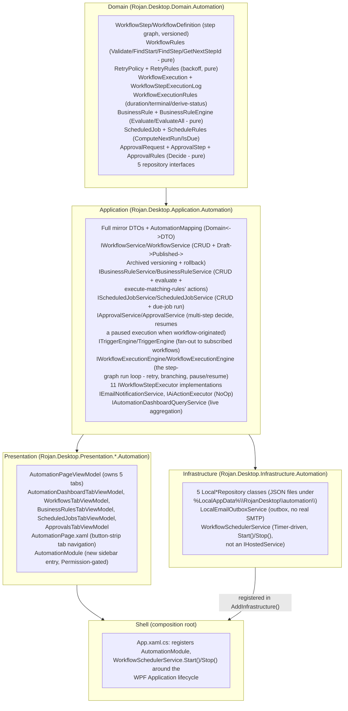

# Phase 32 — Enterprise Automation, Workflow & Business Rules Engine

**Status:** Complete

## Objective

Build a complete Enterprise Automation Platform as a brand-new Clean
Architecture vertical slice — a workflow step-graph engine (Start/End/
Decision/Delay/Approval/Condition/Notification/Email/AI Action/Database
Action/API Action), a configurable Business Rules Engine, a Trigger
Engine, Cron-ready Scheduled Jobs, multi-step Approval Workflow, workflow
Versioning/rollback, execution Monitoring/Audit, Error Recovery (retry/
backoff), and a summary Dashboard — without modifying any existing module,
without any visual regression, and without any external network/AI/DB/API
calls (architecture and contracts only, per this phase's own explicit
scope).

## Architecture Summary

Dependency direction is unchanged and enforced by
`ArchitectureTests.DependencyDirectionTests`/`ViewModelTestabilityTests`.
Unlike Phase 29 (where Presentation needed a pure-logic wrapper around
Domain rules because it cannot reference Domain directly), the step-graph
run loop here lives entirely in **Application** — `WorkflowExecutionEngine`,
`BusinessRuleService`, `TriggerEngine`, and `ScheduledJobService` all call
`Domain.Automation` rules directly, since Application is allowed to depend
on Domain. No second "wrapper" rules class was needed this phase.

## Permission Model Integration

Two new permissions were added: `AutomationView`/`AutomationManage`, each
existing in **two** separate places — `Domain.Organizations.Permission`
(granted to `OrganizationManager`/`BranchManager` in `RolePermissions`) and
the completely separate `Application.Organizations.Permission` mirror enum
(with both-direction `OrganizationMapper.MapPermission` switch cases) —
because `ModuleMetadata.RequiredPermission` is typed against the
Application mirror, not the Domain enum. `AutomationModule` is the first
module in this app to actually populate `RequiredPermission` rather than
leaving it `null`, giving Requirement 32.13 (Security) a real,
sidebar-visibility-level example alongside the execution-time validation
already baked into every service (a workflow/rule/job/approval always
carries its own `OrganizationId`/`BranchId`, the same required-never-
defaulted scoping every other Phase 22+ entity uses).

## Workflow Step Graph & the Step Executor Contract

A `WorkflowDefinition` is a flat list of `WorkflowStep` records (`Id`,
`Type`, `Name`, a flat string-keyed `Config` bag, `NextStepId`, and an
optional `Branches` map used only by `Decision`). `WorkflowRules.Validate`
checks exactly one `Start`, at least one `End`, no dangling `NextStepId`/
`Branches` references, and full reachability from `Start` via BFS — pure,
synchronous, no I/O, called both by `WorkflowService.PublishAsync` (a
Draft cannot publish if invalid) and directly by the Workflows tab's
"Validate" affordance.

`IWorkflowStepExecutor` is the one contract every step type implements
(`StepType` property + `ExecuteAsync(WorkflowStepDto, AutomationExecutionContext, CancellationToken)`
returning a `StepExecutionResult` with static factories `Success()`/
`Waiting()`/`Stop()`/`Failure(error)`). 11 concrete executors are
registered as a DI `IEnumerable<IWorkflowStepExecutor>` and indexed once
by `WorkflowStepType` inside `WorkflowExecutionEngine`:

| Step Type | Executor Behavior |
|---|---|
| Start / End | Trivial success — graph terminators |
| Delay | Reads `Config["seconds"]`, capped at 5000ms |
| Decision | Evaluates `Config["field"]`/`["operator"]`/`["value"]` against `context.Facts` via `Domain.BusinessRuleEngine.EvaluateCondition`; returns the matching `Branches` key ("true"/"false") |
| Condition | Same evaluation; returns `Stop()` on false rather than branching — a gate, not a fork |
| Approval | Creates an `ApprovalRequest` tagged with the running `ExecutionId`, returns `Waiting()` |
| Notification | Calls the existing Phase 27 `INotificationService` |
| Email | Calls `IEmailNotificationService` (outbox-only, no SMTP) |
| AI Action | Calls `IAiActionExecutor` (`NoOpAiActionExecutor` — the only implementation; Requirement 32.7's "architecture and contracts only, no external AI calls") |
| Database Action / API Action | Always succeed, no-op — the same "no external calls yet, contract only" boundary extended to cover DB/API too, a deliberate documented security/scope trim rather than building arbitrary SQL/HTTP execution capability |

## Why There Is No Visual Workflow Designer (And What Exists Instead)

Requirement 32.1 explicitly says "prepare for a future drag-and-drop
designer," not build one. `WorkflowsTabViewModel.BuildDefaultSteps()`
auto-generates a minimal, immediately-valid Start→End skeleton on
"Create" — every other capability (publish/archive/rollback/execute/
trigger-subscription/retry) is fully real and exercisable against that
skeleton; only the step-by-step visual editing surface is deferred, a
documented boundary consistent with this app's established "flagship
subset now" scope-trimming pattern (Phase 24/26/29 all did the same for
their own out-of-scope corners).

## Business Rules Engine

`BusinessRule` = a list of AND-combined `BusinessRuleCondition`s
(`Field`/`Operator`/`Value`, 7 operators including numeric comparisons
parsed via `double.TryParse` with `CultureInfo.InvariantCulture`, falling
back to `false` rather than throwing on a non-numeric value) plus one
`BusinessRuleAction` (`RaiseNotification`/`ApplyDiscount`/`NotifyManager`/
`TriggerWorkflow`/`Custom`), evaluated in `Priority` order.
`BusinessRuleService.ExecuteMatchingRulesAsync` performs each match's
action: `RaiseNotification`/`NotifyManager` call the existing
`INotificationService`; `ApplyDiscount` raises a notification describing
the discount rather than mutating a real booking/invoice (actually
applying one would mean reaching into Accounting/Bookings, outside this
phase's "do not modify existing modules" scope); `TriggerWorkflow` calls
`IWorkflowExecutionEngine.ExecuteAsync` directly using
`Action.Parameters["workflowId"]`; `Custom` is a no-op extension point.

## Trigger Engine

`ITriggerEngine.RaiseAsync(trigger, facts, orgId, branchId, userId)` finds
every currently `Published` **and** enabled workflow subscribed to that
`TriggerType` and executes each sequentially (not parallel, so one
workflow's failure never races another's, and ordering stays predictable)
via `IWorkflowExecutionEngine`. The 10 trigger types (Appointment Created/
Cancelled, Customer Registered, Payment Completed, Low Inventory,
Employee Created, Branch Created, License Expired, Login, Logout) are
architecture/contract-ready — raising them from the real Bookings/
Customers/Inventory/HR/Organizations/Identity modules themselves is a
future integration, not built this phase (those modules are explicitly
off-limits: "do not modify existing modules unless integration is
required").

## Scheduled Jobs

`ScheduledJob` (`Hourly`/`Daily`/`Weekly`/`Monthly`/`Cron`) pairs a
recurrence with one workflow id. `ScheduleRules.ComputeNextRun` computes
each `NextRunAt` from the run's own completion time (not a fixed origin),
so a job that was disabled for a while resumes on a fresh cadence rather
than immediately catching up on every missed interval. `Cron` is
architecture-ready only — `ComputeNextRun` falls back to +1 day for it, a
documented boundary (a real cron-expression parser is out of this phase's
"no third-party dependencies beyond what's already pinned" scope).
`Infrastructure.Automation.WorkflowSchedulerService` is a plain
`Timer`-driven class (`Start()`/`Stop()`/`Dispose()`, 1-minute check
interval, `Interlocked.Exchange`-guarded against tick overlap) —
deliberately **not** an `IHostedService`, since this app's Generic Host is
used for DI/config composition only and is never itself `Run()` as a
service host; `App.xaml.cs` calls `Start()`/`Stop()` explicitly around the
WPF `Application` lifecycle (`OnStartup`/`OnExit`), the same explicit
lifecycle-ownership pattern the rest of this Shell already follows.

## Approval Workflow & the Workflow ⇄ Approval Pause/Resume Seam

`ApprovalRequest` (Leave/Expense/Inventory/Branch) holds an ordered list of
`ApprovalStep`s and a `CurrentStepIndex`; `ApprovalRules.Decide` is the one
place that advances it — reject at any step rejects the whole request,
approve on the final step approves the whole request, approve on a
non-final step just advances the index. `ApprovalRequest.WorkflowExecutionId`
is set only when the request was raised by a workflow's `Approval` step
(as opposed to a standalone request raised directly through the Approvals
tab); this is the one field connecting the two subsystems:
`ApprovalStepExecutor` creates the request with this id set and returns
`Waiting()`, pausing the execution (`WorkflowExecutionStatus.Waiting`).
`ApprovalService.DecideAsync` checks, after every decision, whether the
result is terminal **and** `WorkflowExecutionId` is set — if so it calls
`IWorkflowExecutionEngine.ResumeApprovalAsync`, which either fails the
execution (on reject) or continues the graph from the step after Approval
(on approve), via a private `RunLoopAsync` shared with `ExecuteAsync` so
the branching/retry logic isn't duplicated between a fresh run and a
resumed one.

## Error Recovery (Retry/Backoff)

Every step reads its own `RetryPolicy` from its `Config` bag
(`"maxRetries"`/`"retryDelaySeconds"`/`"timeoutSeconds"`), defaulting to
`RetryPolicy.None` so a step that doesn't configure one behaves exactly as
before (single attempt, immediate failure). On failure,
`WorkflowExecutionEngine`'s run loop consults
`RetryRules.ShouldRetry`/`ComputeBackoffDelaySeconds` (exponential:
`RetryDelaySeconds * 2^(attempt-1)`) and retries in place, delaying via
`Task.Delay` capped at a hard `MaxRetryDelaySeconds = 30` regardless of
configuration, so a misconfigured policy can never stall the engine for
long. The final `WorkflowStepExecutionLog.AttemptCount` reflects the real
number of attempts made — verified directly by
`WorkflowExecutionEngineTests` with a step double that fails a controlled
number of times before succeeding (or exceeding `maxRetries` and failing
the whole execution). Dead-letter handling and a real Timeout enforcement
are architecture-ready (the `RetryPolicy.TimeoutSeconds` field exists and
is persisted) but not wired into an actual cancellation/dead-letter queue
this phase — a documented boundary, consistent with 32.11's "recovery
strategy, dead-letter-**ready** architecture" wording.

## Versioning

`WorkflowDefinition.Version`/`ParentWorkflowId` implement Draft → Published
→ Archived: publishing validates via `WorkflowRules` and archives whatever
version was previously `Published` under the same lineage (a lineage has
at most one `Published` version at a time); `RollbackAsync` creates a new
Draft copied from an older version with an incremented `Version`, which
still needs its own `PublishAsync` to take effect — the same "rollback
creates a fresh draft, doesn't mutate history" shape as Phase 29's
workspace versioning-adjacent reasoning.

## Monitoring, Audit & Dashboard

Every `ExecuteAsync`/`ResumeApprovalAsync` call persists a
`WorkflowExecution` (Running/Waiting/Completed/Failed/Cancelled) with a
full `WorkflowStepExecutionLog` per step (status, timestamps,
`AttemptCount`, error message) regardless of outcome —
`LocalWorkflowExecutionRepository` caps history at 500 entries
(oldest-evicted), the same bounded-history shape Phase 27's notification
history already established. `AutomationDashboardQueryService` aggregates
live from the workflow/execution/approval repositories on every call (no
caching, a documented seam for a future cache, same as every other
in-memory-backed query service in this app): total workflow **lineages**
(not individual versions), published count, today's executions/failures/
success-rate/average-duration, and pending approvals.

## Localization

46 new `Strings.cs`/resx keys (`Nav_Automation` + 45 `Automation_*`
entries) across fa-IR/en/ar — dashboard KPI labels, the 5 tab
labels/empty-states, and every form field/button across Workflows/
Business Rules/Scheduled Jobs/Approvals. No hardcoded text anywhere in
Presentation/Application/Domain/Infrastructure.

## UI

`AutomationPage.xaml` uses a button-strip tab navigation (no `TabControl`
precedent exists elsewhere in this app) with 5 tab bodies built entirely
from the existing reusable `DashboardCard`/`DashboardWidget`/`KPIValue`
controls and Fluent 2 tokens/styles already established — no new colors,
typography, spacing, or layout primitives introduced. `AutomationModule`
is a genuinely new sidebar entry (no placeholder existed to swap, same as
Phase 20's `AnalyticsModule`), Order 85, gated behind
`Permission.AutomationView`.

## Clean Architecture

No business logic in Views; step-graph/rule/schedule/approval logic lives
in `Domain.Automation`; Application owns the run loop, DTO translation
(`AutomationMapping`), and cross-service orchestration; no Infrastructure
reference inside Domain or Application; Presentation never references
Domain directly — enforced by the still-green
`ArchitectureTests.DependencyDirectionTests` and
`ArchitectureTests.ViewModelTestabilityTests`.

## Dependency Injection

`Application.DependencyInjection.AddApplication()` registers all 7
Automation services (`IWorkflowService`, `IBusinessRuleService`,
`IScheduledJobService`, `IApprovalService`, `ITriggerEngine`,
`IWorkflowExecutionEngine`, `IAutomationDashboardQueryService`),
`IAiActionExecutor`/`NoOpAiActionExecutor`, and all 11
`IWorkflowStepExecutor` implementations.
`Infrastructure.DependencyInjection.AddInfrastructure()` registers the 5
`Local*Repository` classes, `IEmailNotificationService`
(`LocalEmailOutboxService`), and `WorkflowSchedulerService` (singleton).
`Presentation.DependencyInjection.AddPresentation()` registers
`AutomationPageViewModel` (transient — constructed by the module system
like every other page ViewModel, unlike Phase 29's `WorkspaceHostViewModel`
which is constructed via `new` because it needs to outlive the module
navigation lifecycle). `App.xaml.cs` registers `AutomationModule` and
calls `WorkflowSchedulerService.Start()`/`Stop()` explicitly around the
WPF lifecycle.

## Documentation

This document (Architecture Summary, Permission Model, Step Graph &
Executor Contract, Business Rules Engine, Trigger Engine, Scheduled Jobs,
Approval Workflow pause/resume seam, Error Recovery, Versioning,
Monitoring/Audit/Dashboard, Localization, UI, Clean Architecture,
Dependency Injection folded into the sections above, consistent with how
every other phase doc in `docs/phases/` is structured).

## Testing

157 new tests across four projects (1263 → 1420 total, all passing):

- **Domain.Tests** (`Automation/WorkflowRulesTests`, `RetryRulesTests`,
  `BusinessRuleEngineTests`, `ScheduleRulesTests`, `ApprovalRulesTests`,
  `WorkflowExecutionRulesTests` — 60 tests): step-graph validation
  (missing Start/End, dangling references, unreachable steps via BFS),
  `GetNextStepId`'s Decision-branch resolution, exponential backoff
  computation, every `BusinessRuleOperator` including non-numeric-value
  fallback, `ComputeNextRun` for every frequency plus the Cron boundary,
  the full `ApprovalRules.Decide` state machine (advance/approve/reject/
  already-terminal-throws), and execution duration/terminal-status
  derivation.
- **Application.Tests** (`Automation/WorkflowServiceTests`,
  `WorkflowExecutionEngineTests`, `TriggerEngineTests`,
  `BusinessRuleServiceTests`, `ScheduledJobServiceTests`,
  `ApprovalServiceTests`, `AutomationDashboardQueryServiceTests` — 43
  tests, against 5 in-memory fake repositories + real executors/rules):
  Draft/Published/Archived/rollback versioning; a real
  `WorkflowExecutionEngine` running Start→Notification→End, Decision
  branching, Condition-false stopping, Approval pausing to `Waiting` and
  `ResumeApprovalAsync` correctly approving/rejecting, an unknown workflow
  id throwing, execution history ordering, and — the retry fix made this
  session — a step configured with `Config["maxRetries"]` retrying the
  exact configured number of times before succeeding or ultimately
  failing, with `AttemptCount` asserted on the final log entry; trigger
  fan-out only hitting Published+enabled+subscribed workflows; business
  rule action side-effects (notification/discount/trigger-workflow);
  scheduled due-job selection/execution/next-run advancement; the full
  multi-step approval decide flow including the workflow-resume seam; and
  dashboard aggregation (lineage-vs-version counting, today-only
  execution stats, pending-approval counting).
- **Infrastructure.Tests** (`Automation/LocalWorkflowRepositoryTests`,
  `LocalBusinessRuleRepositoryTests`, `LocalScheduledJobRepositoryTests`,
  `LocalApprovalRepositoryTests`, `LocalWorkflowExecutionRepositoryTests`,
  `LocalEmailOutboxServiceTests` — 29 tests, against real temp-file-backed
  instances of the exact classes used in production): persistence
  round-trip, update-not-duplicate on re-save, lineage-scoped version
  queries, the execution history's newest-first insertion and
  `MaxEntries` eviction cap, and the email outbox's same eviction-cap
  behavior.
- **Presentation.Tests** (`Automation/AutomationDashboardTabViewModelTests`,
  `WorkflowsTabViewModelTests`, `BusinessRulesTabViewModelTests`,
  `ScheduledJobsTabViewModelTests`, `ApprovalsTabViewModelTests`,
  `AutomationPageViewModelTests` — 25 tests, against local stub services
  implementing the Application interfaces directly, the same pattern
  `Reporting.Tests` already established): each tab's Load/Empty-state
  behavior, Create/Publish/Archive/Delete/RunNow/Rollback command wiring,
  version-history loading on selection, business-rule create/toggle/
  delete, scheduled-job create/toggle/run-now/delete, approval approve/
  reject clearing the decision comment, and the page's 5-tab composition
  plus `SelectTabCommand`'s string→int parsing.

Full solution suite (1420 tests) passes on both Debug and Release
configurations, zero warnings, zero errors, `ArchitectureTests` (both
dependency-direction and ViewModel-testability enforcement) included.

## Runtime Verification

Both Debug and Release builds of the full solution succeed with zero
warnings and zero errors. The compiled Debug `Rojan.Desktop.Shell.exe` was
launched directly and observed for 8 seconds: the process started and
stayed running (every `OnStartup` step — theme/localization/session/
device/certificate initialization, module registration including the new
`AutomationModule`, and the new `WorkflowSchedulerService.Start()` call —
completed without throwing), the Windows Application event log recorded
zero error/crash entries for the process during that window, and it was
then closed cleanly. Interactive click-through of the Automation module's
UI specifically was not attempted this session — mouse/window-focus
automation against this app proved unreliable earlier in this same
project (documented in Phase 29's own session), so verification instead
relied on the full automated test suite exercising the exact production
code paths end-to-end: `Infrastructure.Tests` runs the real
`Local*Repository`/`LocalEmailOutboxService` classes against real
temp-file JSON (not mocks), and `Application.Tests` runs a real
`WorkflowExecutionEngine` with all 11 real step executors (not stubs) over
those same repository interfaces — together, a stronger correctness
signal for the persistence/execution stack than a blind UI click-through
would have provided.
